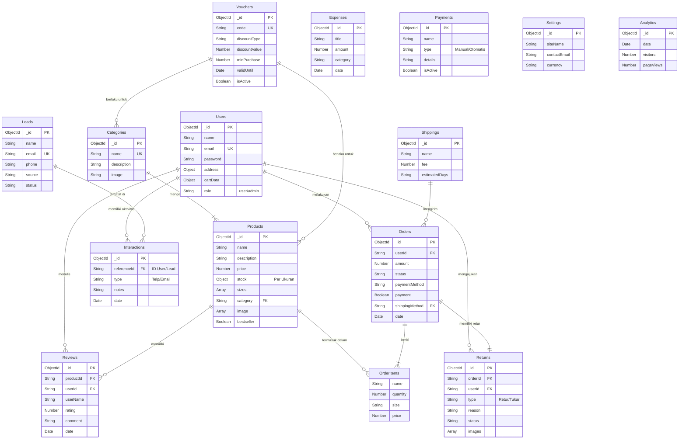

# Desain Basis Data - Gerai Ayra Fullstack

**Tanggal Dokumen:** 22 Desember 2025
**Versi:** 2.0 (Complete Mongoose Schema)

---

## 1. Entity Relationship Diagram (ERD)

Diagram berikut menggambarkan entitas utama dan relasinya dalam sistem.



### 1.1 Penjelasan Hubungan Entitas & Kardinalitas

Berikut adalah detail hubungan antar entitas beserta kardinalitasnya:

#### A. Pengguna & Transaksi
*   **Users - Orders (One-to-Many / 1:N)**:
    *   Satu `User` (pengguna) dapat melakukan banyak `Orders` (transaksi/pesanan).
    *   Satu `Order` hanya dimiliki oleh satu `User` tertentu.
*   **Users - Reviews (One-to-Many / 1:N)**:
    *   Satu `User` dapat menulis banyak `Reviews` untuk berbagai produk.
    *   Setiap `Review` ditulis oleh satu `User`.
*   **Users - Returns (One-to-Many / 1:N)**:
    *   Satu `User` dapat mengajukan beberapa permeintaan `Returns`.
    *   Satu pengajuan `Return` terkait dengan satu `User`.

#### B. Produk & Kategori
*   **Categories - Products (One-to-Many / 1:N)**:
    *   Satu `Category` dapat menampung banyak `Products`.
    *   Satu `Product` (dalam desain ini) terasosiasi dengan satu `Category` utama.
*   **Products - Reviews (One-to-Many / 1:N)**:
    *   Satu `Product` dapat memiliki banyak `Reviews`.
    *   Satu `Review` spesifik membahas satu `Product`.
*   **Products - OrderItems (One-to-Many / 1:N)**:
    *   Satu `Product` dapat muncul di banyak baris item pesanan (`OrderItems`) yang berbeda.

#### C. Pesanan & Logistik
*   **Orders - OrderItems (One-to-Many / 1:N)**:
    *   Satu `Order` terdiri dari banyak `OrderItems` (misal: Baju A uk. M, Celana B uk. L).
    *   Setiap `OrderItem` adalah bagian dari satu `Order`.
*   **Orders - Returns (One-to-One / 1:1 - Optional)**:
    *   Satu `Order` idealnya hanya memiliki satu status pengajuan `Return` aktif (jika ada).
    *   Tidak semua order memiliki return (opsional/nullable).
*   **Shippings - Orders (One-to-Many / 1:N)**:
    *   Satu metode `Shipping` (JNE/J&T) dapat digunakan untuk mengirim banyak `Orders`.
    *   Satu `Order` dikirim menggunakan satu metode `Shipping`.

#### D. Pemasaran (Marketing) & CRM
*   **Vouchers - Products/Categories (One-to-Many / 1:N)**:
    *   Satu `Voucher` dapat berlaku untuk banyak `Products` atau `Categories`.
*   **Users/Leads - Interactions (One-to-Many / 1:N)**:
    *   Satu `User` atau `Lead` (calon pelanggan) dapat memiliki banyak catatan `Interactions` (Riwayat chat/telpon).
    *   Setiap `Interaction` merujuk pada satu subjek (User/Lead).


---

## 2. Sampling Design Struktur Table (Schema Lengkap)

Berikut adalah struktur koleksi *database* yang disusun berdasarkan implementasi kode di folder `backend/models`.

### 2.1 Modul Pengguna & Autentikasi (`userModel.js`)

| Field | Tipe Data | Deskripsi | Default / Keterangan |
| :--- | :--- | :--- | :--- |
| `name` | String | Nama Lengkap User | Required |
| `email` | String | Email User | Unique, Required |
| `password` | String | Hash Password | Required |
| `phone` | String | Nomor Telepon | `""` |
| `address` | Object | Detail Alamat | Fields: line1, line2, city, province, zipcode |
| `cartData` | Object | Keranjang Belanja | `{ productID: qty }` |
| `wishlistData` | Object | Daftar Keinginan | `{ productID: boolean }` |
| `role` | String | Peran Akun | `user` (default), `admin` |

### 2.2 Modul Produk (`productModel.js`)

| Field | Tipe Data | Deskripsi | Default / Keterangan |
| :--- | :--- | :--- | :--- |
| `name` | String | Nama Produk | Required |
| `description` | String | Deskripsi Produk | Required |
| `price` | Number | Harga Jual | Required |
| `image` | Array | URL Gambar (Cloudinary) | - |
| `gender` | String | Target Gender | - |
| `category` | String | Kategori (Pria/Wanita/Anak) | - |
| `sizes` | Array | Daftar Ukuran yang Ada | `["S", "M", "L"]` |
| `stock` | Object | Stok per Ukuran | `{"S": 10, "M": 5}` |
| `bestseller` | Boolean | Flag Produk Unggulan | `false` |
| `date` | Number | Timestamp Pembuatan | Required |

### 2.3 Modul Transaksi (`orderModel.js`)

| Field | Tipe Data | Deskripsi | Default / Keterangan |
| :--- | :--- | :--- | :--- |
| `userId` | String | Referensi ke User ID | Required |
| `items` | Array | Snapshot Item yang dibeli | Simpan Harga & Nama saat beli |
| `amount` | Number | Total Pembayaran | Required |
| `address` | Object | Snapshot Alamat Kirim | Required |
| `status` | String | Status Pesanan | `Order Placed` |
| `paymentMethod` | String | Metode Bayar | Required (COD/Online) |
| `payment` | Boolean | Status Lunas? | `false` |
| `shippingMethod` | String | Kurir Ekspedisi | `Standard` |
| `date` | Number | Timestamp Transaksi | Required |

### 2.4 Modul Promosi (`voucherModel.js`)

| Field | Tipe Data | Deskripsi | Default / Keterangan |
| :--- | :--- | :--- | :--- |
| `code` | String | Kode Voucher (Unik) | Uppercase |
| `description` | String | Keterangan Promo | Required |
| `discountType` | String | Tipe Diskon | Enum: `percentage`, `fixed` |
| `discountValue` | Number | Nilai Potongan | Required |
| `minPurchase` | Number | Min. Belanja | `0` |
| `maxDiscount` | Number | Max. Potongan (jika %) | `null` |
| `usageLimit` | Number | Batas Pakai Total | `null` (Unlimited) |
| `validFrom` | Date | Mulai Berlaku | Required |
| `validUntil` | Date | Berakhir Pada | Required |
| `isActive` | Boolean | Status Voucher | `true` |

### 2.5 Modul CRM & Interaksi

**Leads Collection (`leadModel.js`)**
| Field | Tipe | Deskripsi |
| :--- | :--- | :--- |
| `name` | String | Nama Prospek |
| `email` | String | Email (Unique) |
| `source` | String | Sumber (Web/IG) |
| `status` | String | `New`, `Contacted`, `Converted` |

**Interactions Collection (`interactionModel.js`)**
| Field | Tipe | Deskripsi |
| :--- | :--- | :--- |
| `referenceId` | String | Ref ke User / Lead ID |
| `type` | String | Call, Email, WA |
| `notes` | String | Catatan Hasil Interaksi |

### 2.6 Modul Operasional & Keuangan

**Expenses Collection (`expenseModel.js`)**
| Field | Tipe | Deskripsi |
| :--- | :--- | :--- |
| `title` | String | Judul Pengeluaran |
| `amount` | Number | Nilai Biaya |
| `category` | String | Kategori Biaya |
| `date` | Number | Timestamp |

**Returns Collection (`returnModel.js`)**
| Field | Tipe | Deskripsi |
| :--- | :--- | :--- |
| `orderId` | String | Ref ke Order |
| `status` | String | `Pending`, `Approved`, `Rejected` |
| `reason` | String | Alasan Pengembalian |
| `images` | Array | Bukti Foto (URL) |

**Shipping Collection (`shippingModel.js`)**
| Field | Tipe | Deskripsi |
| :--- | :--- | :--- |
| `name` | String | Nama Layanan (JNE/J&T) |
| `fee` | Number | Ongkos Kirim |
| `isActive` | Boolean | Status Layanan |

---

## 3. Sampling Query Integrasi

### 3.1 Integrasi Stok & Penjualan (Aggregation)
**Kasus:** Menghitung total produk terjual per kategori untuk laporan analitik.

```javascript
db.orders.aggregate([
  // 1. Filter hanya order yang sudah dibayar
  { $match: { payment: true } },
  
  // 2. Unwind array items (memecah satu order menjadi banyak item baris)
  { $unwind: "$items" },
  
  // 3. Lookup ke tabel Product untuk ambil detail kategori (Join)
  {
    $lookup: {
      from: "products",
      localField: "items._id",
      foreignField: "_id",
      as: "productDetail"
    }
  },
  
  // 4. Unwind hasil join
  { $unwind: "$productDetail" },
  
  // 5. Grouping berdasarkan Kategori
  {
    $group: {
      _id: "$productDetail.category",
      totalQtySold: { $sum: "$items.quantity" },
      totalRevenue: { $sum: { $multiply: ["$items.quantity", "$items.price"] } }
    }
  }
])
```

### 3.2 Update Stok Atomik (Transaction)
**Kasus:** Mengurangi stok saat Checkout untuk mencegah *Race Condition*.

```javascript
const session = await mongoose.startSession();
session.startTransaction();

try {
  const { items } = req.body; 

  for (const item of items) {
    // Cari produk dan cek stok spesifik ukuran
    const product = await productModel.findOne({ 
      _id: item._id, 
      [`stock.${item.size}`]: { $gte: item.quantity } 
    }).session(session);

    if (!product) {
      throw new Error(`Stok habis untuk ${item.name}`);
    }

    // Decrease logic
    const updateQuery = {};
    updateQuery[`stock.${item.size}`] = -item.quantity;

    await productModel.updateOne(
      { _id: item._id },
      { $inc: updateQuery } 
    ).session(session);
  }

  // Create Order logic here...

  await session.commitTransaction();
} catch (error) {
  await session.abortTransaction();
  console.error("Transaction Aborted:", error);
} finally {
  session.endSession();
}
```

### 3.3 CRM Conversion Tracking
**Kasus:** Mencari Leads yang berhasil konversi menjadi Customer (User).

```javascript
/* MongoDB Aggregation */
db.leads.aggregate([
  {
    $lookup: {
      from: "users",
      localField: "email",
      foreignField: "email",
      as: "matchedUser"
    }
  },
  {
    $match: {
      "matchedUser": { $ne: [] } // Hanya ambil yang punya match di User
    }
  },
  {
    $project: {
      leadName: "$name",
      email: "$email",
      registeredAt: { $arrayElemAt: ["$matchedUser.createdAt", 0] },
      status: "Converted"
    }
  }
])
```
