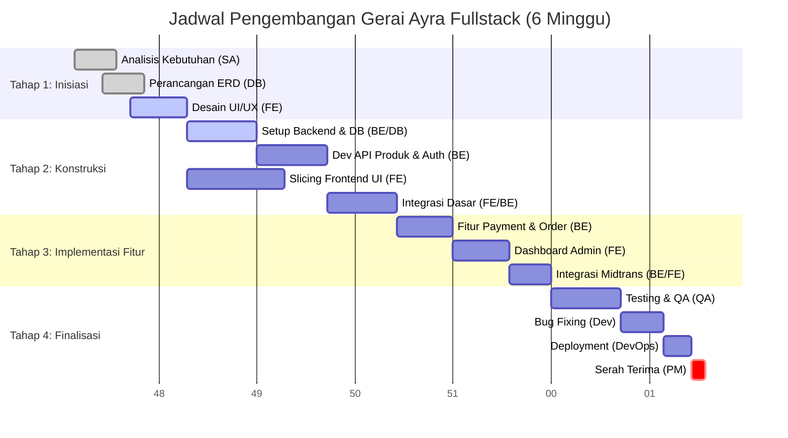

# Timeline Pengerjaan Proyek Gerai Ayra Fullstack

**Durasi Total:** 6 Minggu
**Status:** Perencanaan

---

## 1. Minggu 1: Perencanaan & Analisis
**Fokus:** Memahami kebutuhan bisnis dan merancang arsitektur dasar.

| Peran | Aktivitas Utama | Output |
| :--- | :--- | :--- |
| **Project Manager** | Kick-off meeting, penetapan timeline, pembagian tugas. | Project Charter, Timeline Final. |
| **System Analyst** | Wawancara klien, analisis kebutuhan fungsional, pembuatan diagram (Use Case, Flowchart). | Dokumen `ANALISIS_KEBUTUHAN_SISTEM.md`. |
| **Database Engineer**| Perancangan ERD awal, identifikasi entitas utama. | Draft ERD. |
| **QA** | Mempelajari requirement untuk persiapan skenario tes. | Draft Test Plan. |

---

## 2. Minggu 2: Desain Sistem & Database
**Fokus:** Mematangkan struktur data dan desain antarmuka.

| Peran | Aktivitas Utama | Output |
| :--- | :--- | :--- |
| **System Analyst** | Finalisasi BPMN dan detail alur proses bisnis. | Dokumen Alur Proses Final. |
| **Database Engineer**| Pembuatan skema MongoDB (Mongoose), setup cluster database, indexing strategy. | Dokumen `DATABASE_DESIGN.md`, Koneksi DB. |
| **Backend Dev** | Setup repository, konfigurasi server (Express), setup environment variables. | Repo Backend Ready, Server "Hello World". |
| **Frontend Dev** | Membuat wireframe/mockup UI (Figma), setup proyek React/Vite + Tailwind. | Mockup UI, Repo Frontend Ready. |

---

## 3. Minggu 3: Pengembangan Backend (API)
**Fokus:** Membangun logika bisnis dan endpoint API.

| Peran | Aktivitas Utama | Output |
| :--- | :--- | :--- |
| **Backend Dev** | Implementasi Auth (JWT), CRUD Produk, Modul Upload Gambar (Cloudinary). | API: `/user`, `/product`. |
| **Database Engineer**| Optimasi query, validasi skema data, seed data dummy. | Database terisi data dummy. |
| **Frontend Dev** | Slicing UI komponen dasar (Navbar, Hero, Product Card). | Library Komponen UI. |
| **QA** | Membuat Test Case untuk API Testing (Postman/Jest). | List Test Case API. |

---

## 4. Minggu 4: Pengembangan Frontend & Integrasi Dasar
**Fokus:** Menghubungkan antarmuka dengan data backend.

| Peran | Aktivitas Utama | Output |
| :--- | :--- | :--- |
| **Frontend Dev** | Integrasi Login/Register, Halaman Produk, Detail Produk, Keranjang (Context). | Frontend Berfungsi (Browse & Cart). |
| **Backend Dev** | Implementasi API Transaksi (Order Place) dan Logika Stok. | API: `/order`, `/cart`. |
| **Project Manager** | Review progress tengah jalan (Mid-Review), mitigasi risiko keterlambatan. | Laporan Progress Mingguan. |
| **QA** | Testing integrasi Frontend-Backend tahap awal. | Laporan Bug Tahap 1. |

---

## 5. Minggu 5: Fitur Lanjutan & Admin Panel
**Fokus:** Fitur kompleks (Payment, Voucher) dan manajemen backoffice.

| Peran | Aktivitas Utama | Output |
| :--- | :--- | :--- |
| **Backend Dev** | Integrasi Payment Gateway (Midtrans), API Voucher, API CRM/Analytics. | API Full Feature. |
| **Frontend Dev** | Halaman Checkout (Payment), Dashboard Admin (Chart, Table), Fitur Profile User. | Frontend Full Feature, Admin Panel. |
| **System Analyst** | Validasi kesesuaian fitur dengan requirement awal. | Checklist Requirement. |
| **QA** | Melakukan tes fungsional menyeluruh (End-to-End). | Laporan Hasil Uji (Pass/Fail). |

---

## 6. Minggu 6: Testing, Fix, & Deployment
**Fokus:** Stabilitas sistem, perbaikan bug, dan peluncuran.

| Peran | Aktivitas Utama | Output |
| :--- | :--- | :--- |
| **QA** | Blackbox testing final, Regression testing, UAT (User Acceptance Test). | Dokumen `TEST_REPORT.md` Final. |
| **Dev Team** | Bug fixing berdasarkan laporan QA, optimasi performa. | Codebase Stabil (v1.0). |
| **Database Engineer**| Backup data, setup environment produksi. | Database Production Ready. |
| **Project Manager** | Final presentation, serah terima dokumen & source code. | Project Sign-off. |

---

## Gantt Chart Detail

