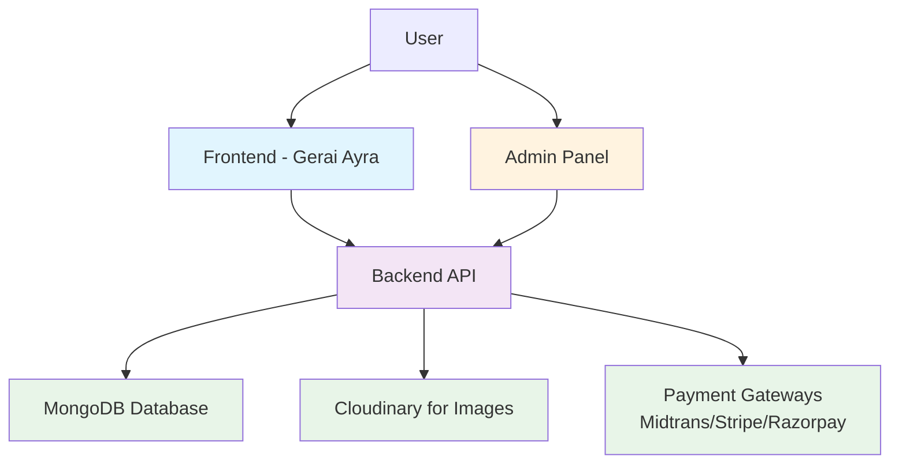
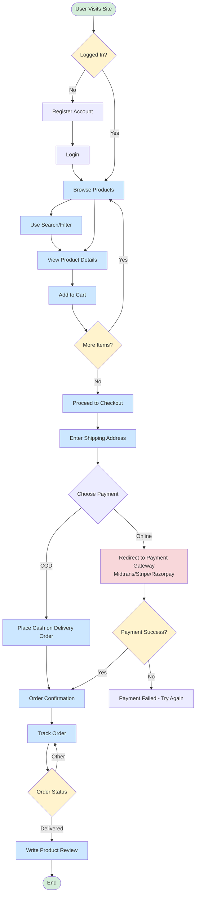
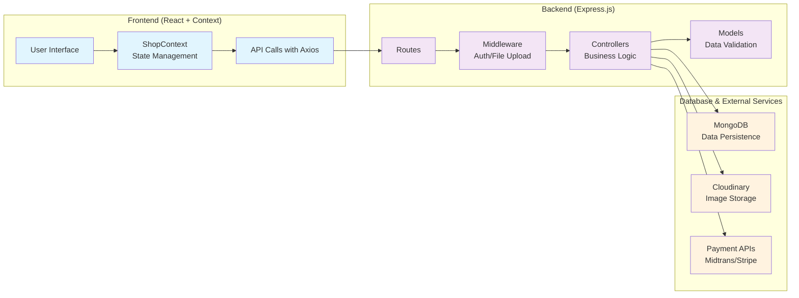
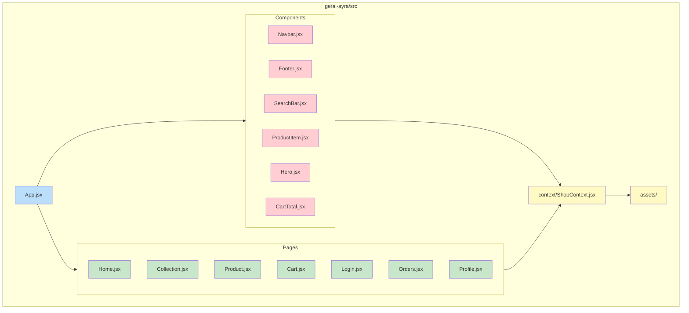
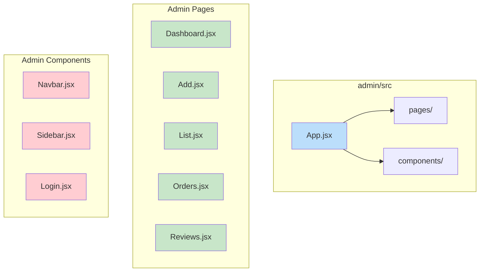
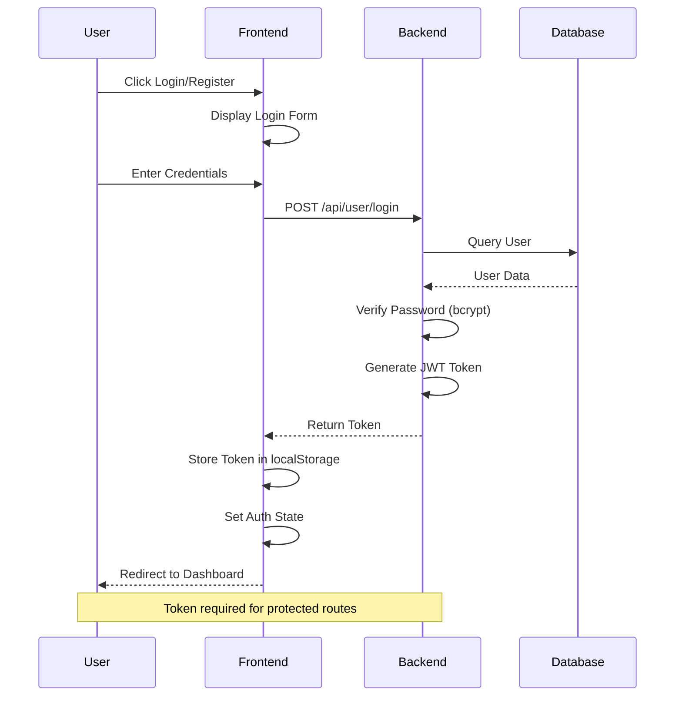
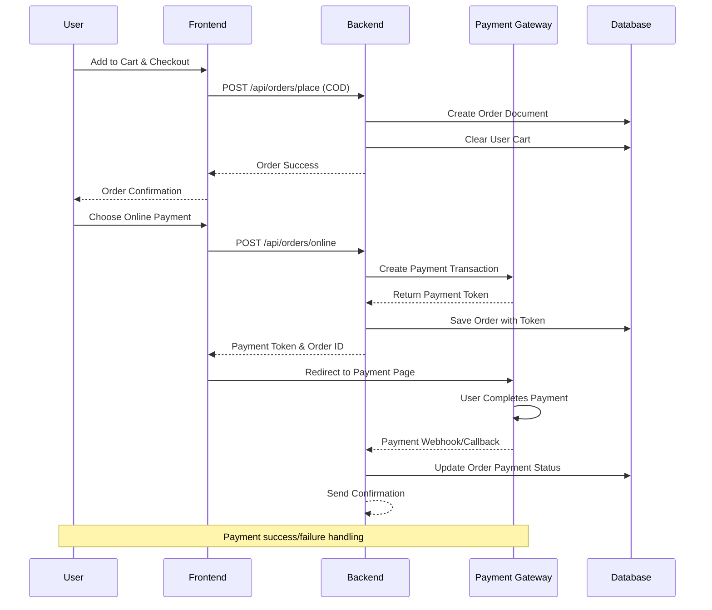

# Gerai Ayra Fullstack Application Flowchart

## High-Level Architecture



## Backend API Structure

```mermaid
graph TB
    subgraph "Express Server"
        H[Routes] --> I[Controllers]
        I --> J[Models]
        H --> K[Middleware]
    end

    subgraph "Routes"
        L[/api/user] --> M[User Routes<br/>login/register/admin]
        N[/api/product] --> O[Product Routes<br/>add/list/remove/update]
        P[/api/cart] --> Q[Cart Routes<br/>add/get/update]
        R[/api/orders] --> S[Order Routes<br/>place/list/status/update]
        T[/api/review] --> U[Review Routes<br/>add/get/delete/update]
    end

    subgraph "Models"
        V[User Model]
        W[Product Model]
        X[Order Model]
        Y[Review Model]
    end

    subgraph "Middleware"
        Z[auth.js - User Auth]
        AA[adminAuth.js - Admin Auth]
        BB[multer.js - File Upload]
    end

    classDef route fill:#bbdefb
    classDef controller fill:#c8e6c9
    classDef model fill:#ffcdd2
    classDef middleware fill:#fff9c4

    class L,N,P,R,T route
    class I controller
    class V,W,X,Y model
    class Z,AA,BB middleware
```

## Database Schema Relations

```mermaid
erDiagram
    USERS ||--o{ ORDERS : places
    USERS ||--o{ REVIEWS : writes
    USERS {
        string _id PK
        string name
        string email UK
        string password hashed
        object cartData
        date createdAt
    }

    PRODUCTS ||--o{ ORDERS : "ordered in"
    PRODUCTS {
        string _id PK
        string name
        string description
        number price
        array image
        string category
        string subCategory
        array sizes
        boolean bestseller
        number date
        date createdAt
        date updatedAt
    }

    ORDERS {
        string _id PK
        string userId FK
        array items
        number amount
        object address
        string status
        string paymentMethod
        boolean payment
        number date
    }

    REVIEWS {
        string _id PK
        string productId FK
        string userId FK
        string userName
        number rating
        string comment
        number date
    }
```

## Application Flow - User Journey



## Admin Panel Flow

```mermaid
flowchart TD
    AdminStart([Admin Login]) --> AdminAuth[Authenticate Admin]
    AdminAuth --> Dashboard[Dashboard Overview]

    Dashboard --> ManageProducts{Manage Products}
    ManageProducts -->|Add| AddProduct[Add New Product]
    ManageProducts -->|List/Edit| ListProducts[List/Edit Products]
    ManageProducts -->|Delete| DeleteProduct[Delete Product]

    Dashboard --> ManageOrders{Manage Orders}
    ManageOrders -->|View| ViewOrders[View All Orders]
    ManageOrders -->|Update Status| UpdateOrderStatus[Update Order Status]

    Dashboard --> ManageReviews{Manage Reviews}
    ManageReviews -->|View| ViewReviews[View All Reviews]
    ManageReviews -->|Moderate| ModerateReview[Moderate Reviews]

    Dashboard --> ManageUsers{Manage Users}
    ManageUsers -->|View| ViewUsers[View User Statistics]

    AddProduct --> Dashboard
    ListProducts --> Dashboard
    DeleteProduct --> Dashboard
    ViewOrders --> Dashboard
    UpdateOrderStatus --> Dashboard
    ViewReviews --> Dashboard
    ModerateReview --> Dashboard
    ViewUsers --> Dashboard

    classDef auth fill:#f8d7da
    classDef process fill:#cce7ff
    classDef decision fill:#fff3cd
    classDef end fill:#d4edda

    class AdminAuth auth
    class AddProduct,ListProducts,DeleteProduct,ViewOrders,UpdateOrderStatus,ViewReviews,ModerateReview,ViewUsers process
    class ManageProducts,ManageOrders,ManageReviews,ManageUsers decision
    class Dashboard end
```

## Data Flow Architecture



## Component Architecture (Frontend)



## Component Architecture (Admin Panel)



## Authentication Flow



## Order Processing Flow



## Technologies Used

- **Frontend**: React 18, React Router, Axios, Tailwind CSS, Vite
- **Backend**: Node.js, Express.js, MongoDB, Mongoose
- **Authentication**: JWT, bcrypt
- **File Upload**: Multer, Cloudinary
- **Payment**: Midtrans, Stripe, Razorpay
- **Deployment**: Vercel

## Key Features

- 🛍️ **E-commerce Platform**: Product browsing, cart, checkout
- 👤 **User Management**: Registration, login, profile management
- ⚡ **Admin Panel**: Product/order/review management
- 💳 **Multiple Payment Options**: COD, online payments
- 📦 **Order Tracking**: Real-time order status updates
- ⭐ **Review System**: Product ratings and reviews
- 🖼️ **Media Management**: Cloudinary integration for images
- 🔍 **Search & Filters**: Advanced product search functionality
