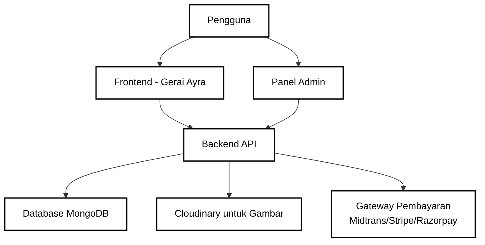
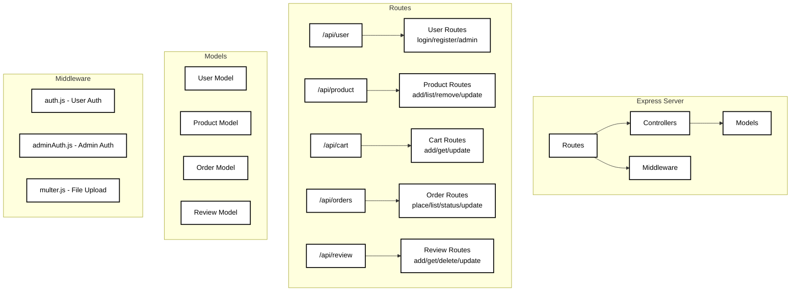
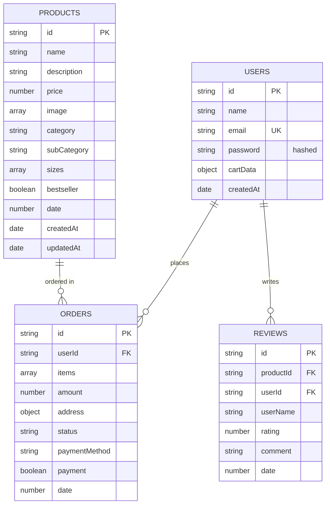
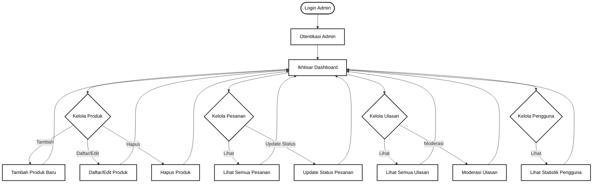
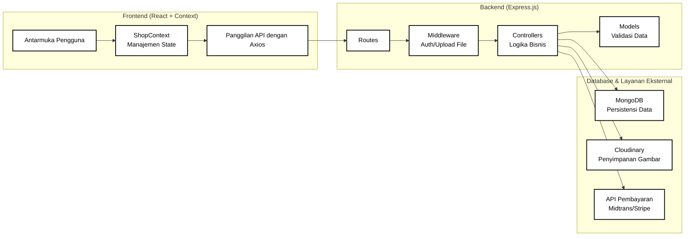
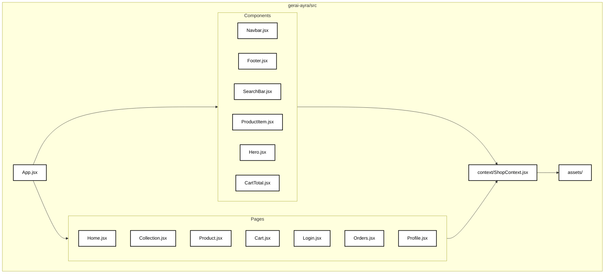
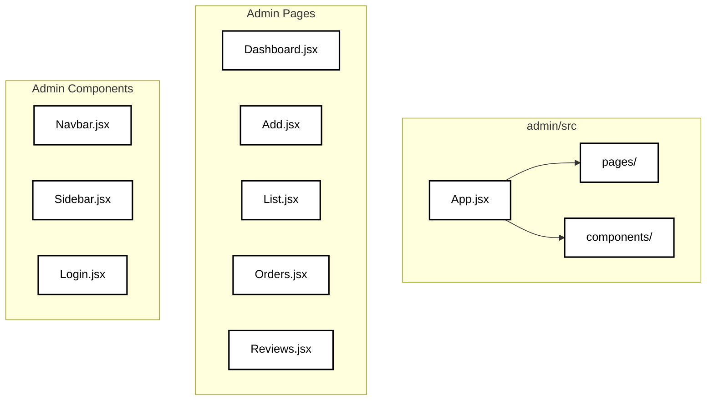
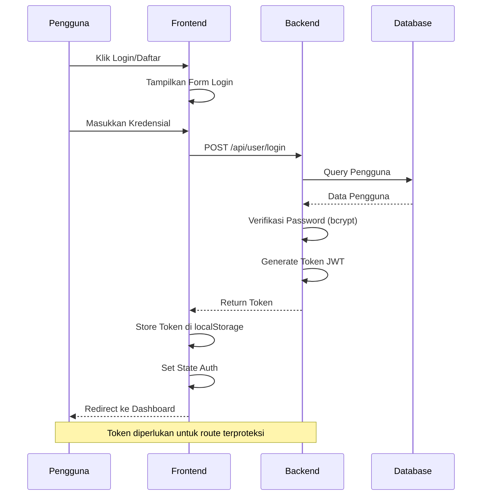
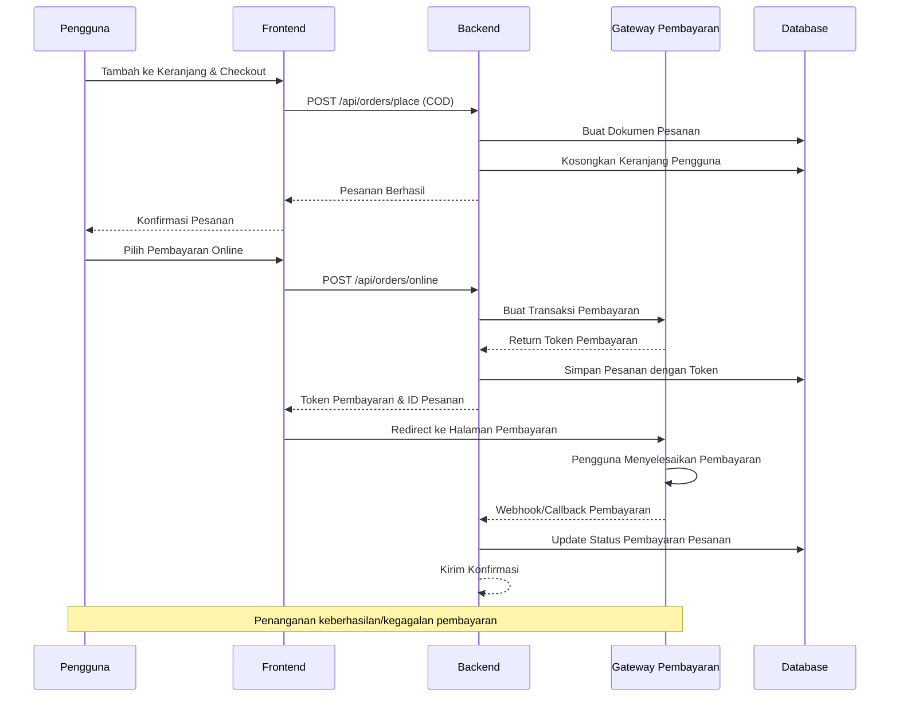

# Diagram Alir Aplikasi Gerai Ayra Fullstack

## Arsitektur Tingkat Tinggi

## Struktur API Backend

## Relasi Skema Database

## Alur Aplikasi - Perjalanan Pengguna

## Alur Panel Admin

## Data Flow Architecture

## Component Architecture (Frontend)

## Component Architecture (Admin Panel)

## Authentication Flow

## Order Processing Flow

## Teknologi Yang Digunakan

- **Frontend**: React 18, React Router, Axios, Tailwind CSS, Vite
- **Backend**: Node.js, Express.js, MongoDB, Mongoose
- **Authentication**: JWT, bcrypt
- **File Upload**: Multer, Cloudinary
- **Payment**: Midtrans, Stripe, Razorpay
- **Deployment**: Vercel

## Fitur Utama

- 🛍️ **Platform E-commerce**: Jelajahi produk, keranjang belanja, checkout
- 👤 **Manajemen Pengguna**: Pendaftaran, login, manajemen profil
- ⚡ **Panel Admin**: Manajemen produk/pesanan/ulasan
- 💳 **Opsi Pembayaran Beragam**: COD, pembayaran online
- 📦 **Pelacakan Pesanan**: Update status pesanan waktu nyata
- ⭐ **Sistem Ulasan**: Rating dan ulasan produk
- 🖼️ **Manajemen Media**: Integrasi Cloudinary untuk gambar
- 🔍 **Pencarian & Filter**: Fungsi pencarian produk canggih
