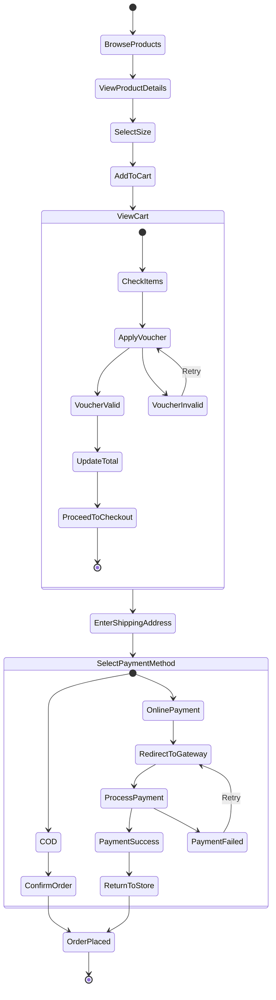
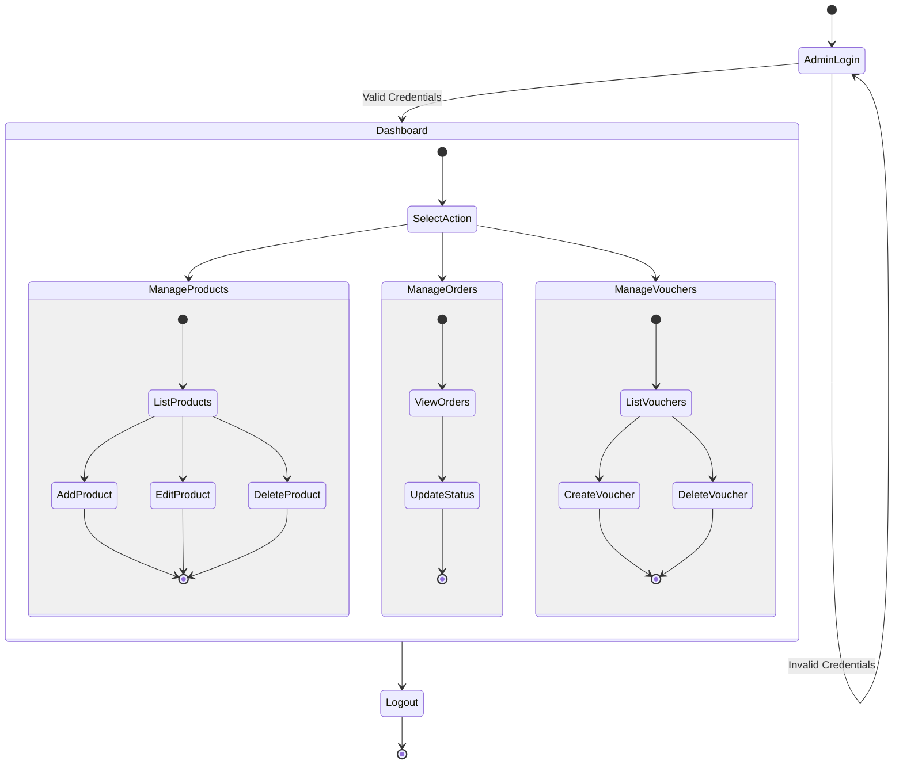

# Activity Diagrams - Gerai Ayra

## 1. User Shopping Activity

```mermaid
stateDiagram-v2
    [*] --> BrowseProducts
    BrowseProducts --> ViewProductDetails
    ViewProductDetails --> SelectSize
    SelectSize --> AddToCart
    AddToCart --> ViewCart

    state ViewCart {
        [*] --> CheckItems
        CheckItems --> ApplyVoucher
        ApplyVoucher --> VoucherValid
        ApplyVoucher --> VoucherInvalid
        VoucherInvalid --> ApplyVoucher : Retry
        VoucherValid --> UpdateTotal
        UpdateTotal --> ProceedToCheckout
        ProceedToCheckout --> [*]
    }

    ViewCart --> EnterShippingAddress
    EnterShippingAddress --> SelectPaymentMethod

    state SelectPaymentMethod {
        [*] --> COD
        [*] --> OnlinePayment
        COD --> ConfirmOrder
        OnlinePayment --> RedirectToGateway
        RedirectToGateway --> ProcessPayment
        ProcessPayment --> PaymentSuccess
        ProcessPayment --> PaymentFailed
        PaymentFailed --> RedirectToGateway : Retry
        PaymentSuccess --> ReturnToStore
    }

    ConfirmOrder --> OrderPlaced
    ReturnToStore --> OrderPlaced
    OrderPlaced --> [*]
```

## 2. Admin Management Activity

```mermaid
stateDiagram-v2
    [*] --> AdminLogin
    AdminLogin --> Dashboard : Valid Credentials
    AdminLogin --> AdminLogin : Invalid Credentials

    state Dashboard {
        [*] --> SelectAction
        SelectAction --> ManageProducts
        SelectAction --> ManageOrders
        SelectAction --> ManageVouchers
        
        state ManageProducts {
            [*] --> ListProducts
            ListProducts --> AddProduct
            ListProducts --> EditProduct
            ListProducts --> DeleteProduct
            AddProduct --> [*]
            EditProduct --> [*]
            DeleteProduct --> [*]
        }

        state ManageOrders {
            [*] --> ViewOrders
            ViewOrders --> UpdateStatus
            UpdateStatus --> [*]
        }

        state ManageVouchers {
            [*] --> ListVouchers
            ListVouchers --> CreateVoucher
            ListVouchers --> DeleteVoucher
            CreateVoucher --> [*]
            DeleteVoucher --> [*]
        }
    }

    Dashboard --> Logout
    Logout --> [*]
```
