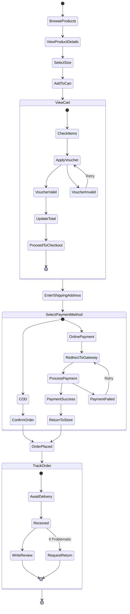
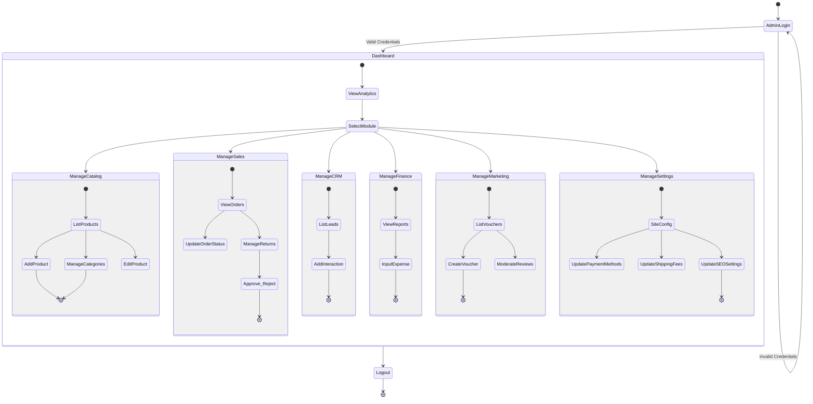

# Activity Diagrams - Gerai Ayra Fullstack

## 1. User Shopping & Post-Purchase Activity

```mermaid
stateDiagram-v2
    [*] --> BrowseProducts
    BrowseProducts --> ViewProductDetails
    ViewProductDetails --> SelectSize
    SelectSize --> AddToCart
    AddToCart --> ViewCart

    state ViewCart {
        [*] --> CheckItems
        CheckItems --> ApplyVoucher
        ApplyVoucher --> VoucherValid
        ApplyVoucher --> VoucherInvalid
        VoucherInvalid --> ApplyVoucher : Retry
        VoucherValid --> UpdateTotal
        UpdateTotal --> ProceedToCheckout
        ProceedToCheckout --> [*]
    }

    ViewCart --> EnterShippingAddress
    EnterShippingAddress --> SelectPaymentMethod

    state SelectPaymentMethod {
        [*] --> COD
        [*] --> OnlinePayment
        COD --> ConfirmOrder
        OnlinePayment --> RedirectToGateway
        RedirectToGateway --> ProcessPayment
        ProcessPayment --> PaymentSuccess
        ProcessPayment --> PaymentFailed
        PaymentFailed --> RedirectToGateway : Retry
        PaymentSuccess --> ReturnToStore
    }

    ConfirmOrder --> OrderPlaced
    ReturnToStore --> OrderPlaced
    OrderPlaced --> TrackOrder
    
    state TrackOrder {
        [*] --> AwaitDelivery
        AwaitDelivery --> Received
        Received --> WriteReview
        Received --> RequestReturn : If Problematic
        WriteReview --> [*]
        RequestReturn --> [*]
    }
    
    TrackOrder --> [*]
```

## 2. Admin Management Activity (Full Backoffice)

```mermaid
stateDiagram-v2
    [*] --> AdminLogin
    AdminLogin --> Dashboard : Valid Credentials
    AdminLogin --> AdminLogin : Invalid Credentials

    state Dashboard {
        [*] --> ViewAnalytics
        ViewAnalytics --> SelectModule
        
        state ManageCatalog {
            [*] --> ListProducts
            ListProducts --> ManageCategories
            ListProducts --> AddProduct
            ListProducts --> EditProduct
            AddProduct --> [*]
            ManageCategories --> [*]
        }

        state ManageSales {
            [*] --> ViewOrders
            ViewOrders --> UpdateOrderStatus
            ViewOrders --> ManageReturns
            ManageReturns --> Approve_Reject
            Approve_Reject --> [*]
        }

        state ManageCRM {
            [*] --> ListLeads
            ListLeads --> AddInteraction
            AddInteraction --> [*]
        }

        state ManageFinance {
            [*] --> ViewReports
            ViewReports --> InputExpense
            InputExpense --> [*]
        }
        
        state ManageMarketing {
            [*] --> ListVouchers
            ListVouchers --> CreateVoucher
            ListVouchers --> ModerateReviews
            CreateVoucher --> [*]
        }

        state ManageSettings {
            [*] --> SiteConfig
            SiteConfig --> UpdatePaymentMethods
            SiteConfig --> UpdateShippingFees
            SiteConfig --> UpdateSEOSettings
            UpdateSEOSettings --> [*]
        }

        SelectModule --> ManageCatalog
        SelectModule --> ManageSales
        SelectModule --> ManageCRM
        SelectModule --> ManageFinance
        SelectModule --> ManageMarketing
        SelectModule --> ManageSettings
    }

    Dashboard --> Logout
    Logout --> [*]
```
