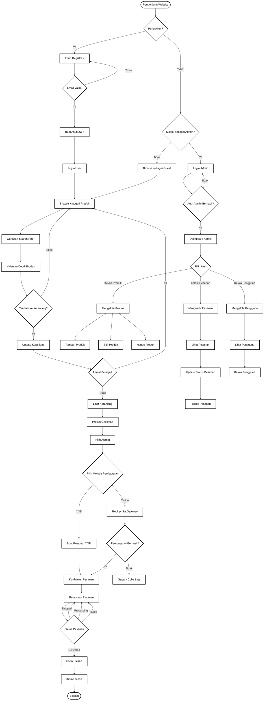
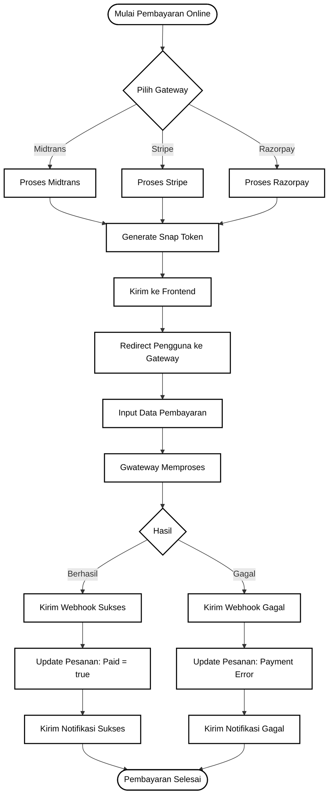
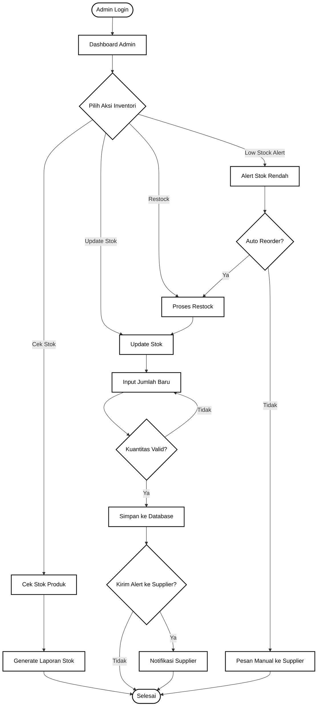
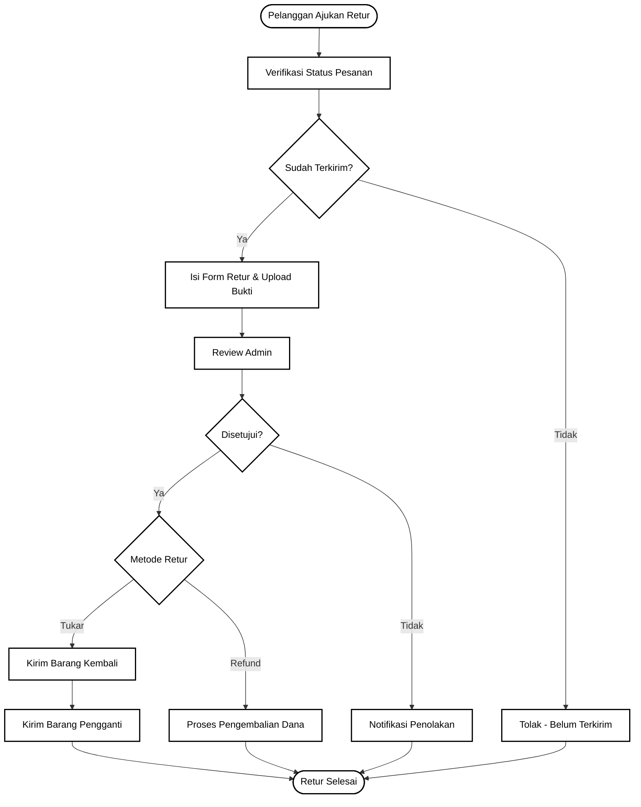
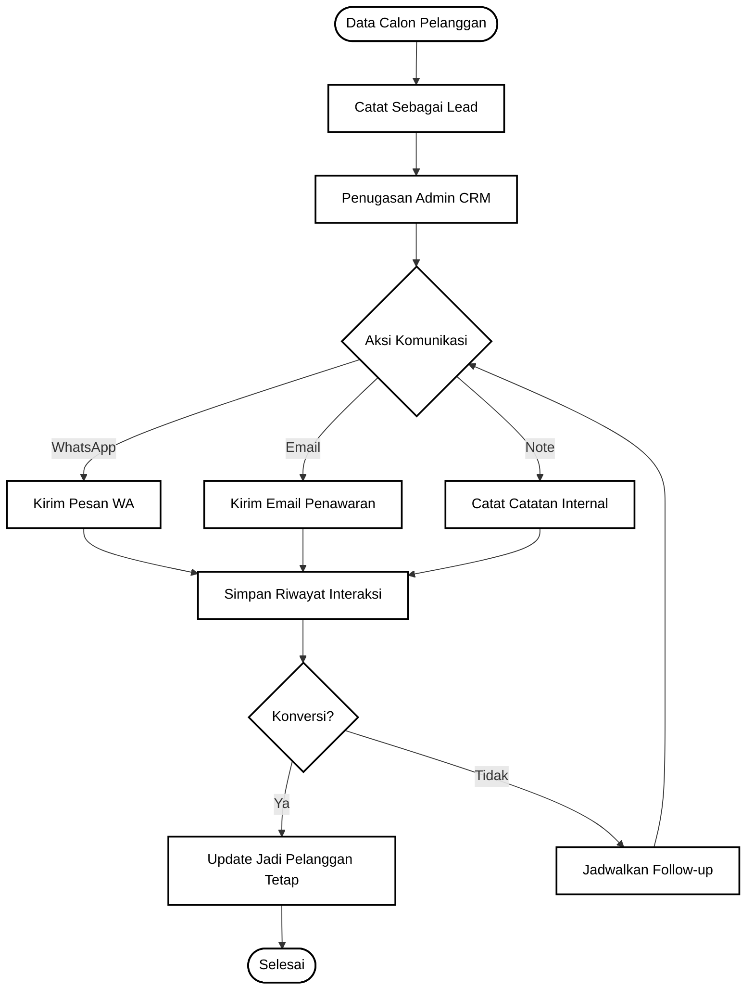
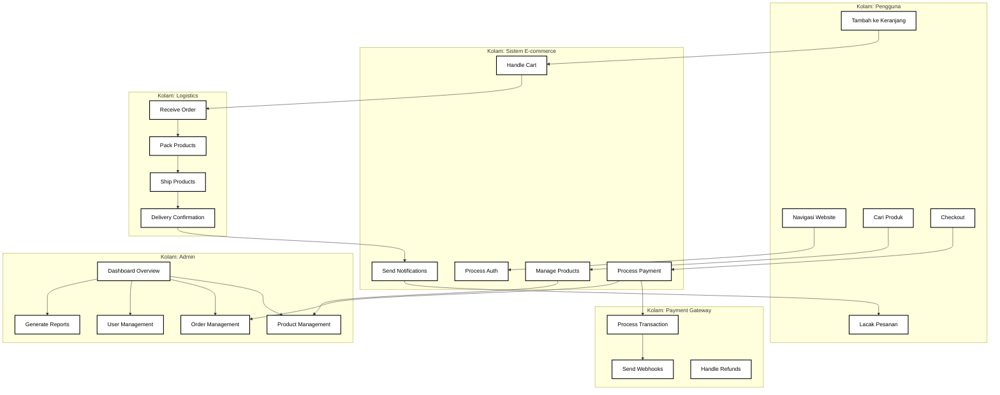

# BPMN Diagram - Proses Bisnis E-commerce Gerai Ayra

## Proses Utama: Perjalanan Pembeli



## Sub-Proses: Penanganan Pembayaran Online



## Sub-Proses: Manajemen Inventori Admin



## Sub-Proses: Penanganan Retur & Pengembalian



## Sub-Proses: Manajemen Hubungan Pelanggan (CRM)



## Pool dan Lane: Stakeholders



## Notasi BPMN Yang Digunakan

### **Event (Events)**
- **Start Event** ⭕ - Titik awal proses
- **End Event** ⭕ - Titik akhir proses
- **Intermediate Event** ⭕ - Event di tengah proses

### **Activity (Activities)**
- **Task** ▭ - Satu unit kerja yang dilakukan oleh manusia atau sistem
- **Sub-Process** ▭▭ - Proses yang berisi sub-proses

### **Gateway (Gateways)**
- **Exclusive Gateway** ⬨ - Keputusan biner (Ya/Tidak)
- **Inclusive Gateway** ⬨ - Multiple paths, satu atau lebih
- **Parallel Gateway** ➕ - Semua paths bersamaan

### **Swimlanes**
- **Pool** - Stakeholder utama atau sistem
- **Lane** - Sub-divisi dalam pool

### **Flow Objects**
- **Sequence Flow** → - Urutan aktivitas
- **Message Flow** ➤ - Komunikasi antar pools
- **Association** -- - Hubungan antara objek

## Metrik BPMN dalam Sistem

| Elemen BPMN | Jumlah | Kegunaan |
|-------------|---------|----------|
| Start Events | 5 | Titik masuk berbagai proses |
| End Events | 7 | Penyelesaian semua flow |
| Tasks | 42 | Operasi bisnis individual |
| Gateways | 12 | Keputusan dalam proses |
| Pools | 5 | Stakeholder utama |
| Lanes | 5 | Sub-proses per stakeholder |

## Legenda Simbol BPMN

```
⭕ Start/End Event
▭ Task/Activity
⬨ Gateway (Decision)
→ Sequence Flow
➤ Message Flow
-- Association
