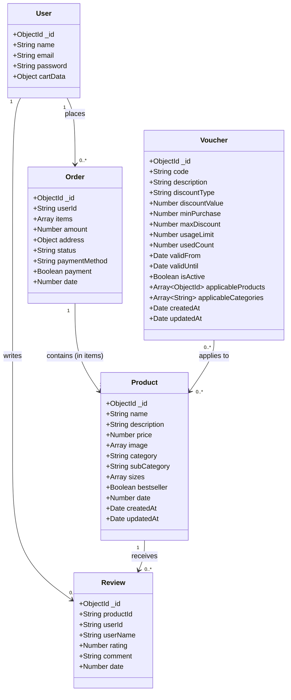

```mermaid
classDiagram
    class User {
        +ObjectId _id
        +String name
        +String email
        +String password
        +Object cartData
    }

    class Product {
        +ObjectId _id
        +String name
        +String description
        +Number price
        +Array image
        +String category
        +String subCategory
        +Array sizes
        +Boolean bestseller
        +Number date
        +Date createdAt
        +Date updatedAt
    }

    class Order {
        +ObjectId _id
        +String userId
        +Array items
        +Number amount
        +Object address
        +String status
        +String paymentMethod
        +Boolean payment
        +Number date
    }

    class Review {
        +ObjectId _id
        +String productId
        +String userId
        +String userName
        +Number rating
        +String comment
        +Number date
    }

    class Voucher {
        +ObjectId _id
        +String code
        +String description
        +String discountType
        +Number discountValue
        +Number minPurchase
        +Number maxDiscount
        +Number usageLimit
        +Number usedCount
        +Date validFrom
        +Date validUntil
        +Boolean isActive
        +Array~ObjectId~ applicableProducts
        +Array~String~ applicableCategories
        +Date createdAt
        +Date updatedAt
    }

    User "1" --> "0..*" Order : places
    User "1" --> "0..*" Review : writes
    Product "1" --> "0..*" Review : receives
    Order "1" --> "1..*" Product : contains (in items)
    Voucher "0..*" --> "0..*" Product : applies to
```
