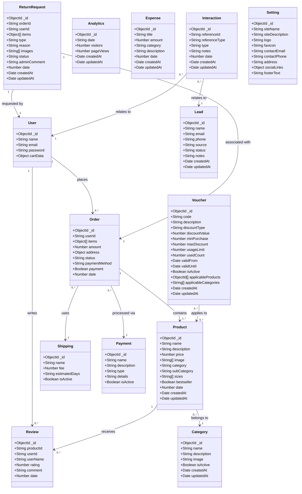

```mermaid
classDiagram
    class User {
        +ObjectId _id
        +String name
        +String email
        +String password
        +Object cartData
    }

    class Product {
        +ObjectId _id
        +String name
        +String description
        +Number price
        +String[] image
        +String category
        +String subCategory
        +String[] sizes
        +Boolean bestseller
        +Number date
        +Date createdAt
        +Date updatedAt
    }

    class Category {
        +ObjectId _id
        +String name
        +String description
        +String image
        +Boolean isActive
        +Date createdAt
        +Date updatedAt
    }

    class Order {
        +ObjectId _id
        +String userId
        +Object[] items
        +Number amount
        +Object address
        +String status
        +String paymentMethod
        +Boolean payment
        +Number date
    }

    class Review {
        +ObjectId _id
        +String productId
        +String userId
        +String userName
        +Number rating
        +String comment
        +Number date
    }

    class Voucher {
        +ObjectId _id
        +String code
        +String description
        +String discountType
        +Number discountValue
        +Number minPurchase
        +Number maxDiscount
        +Number usageLimit
        +Number usedCount
        +Date validFrom
        +Date validUntil
        +Boolean isActive
        +ObjectId[] applicableProducts
        +String[] applicableCategories
        +Date createdAt
        +Date updatedAt
    }

    class ReturnRequest {
        +ObjectId _id
        +String orderId
        +String userId
        +Object[] items
        +String type
        +String reason
        +String[] images
        +String status
        +String adminComment
        +Number date
        +Date createdAt
        +Date updatedAt
    }

    class Analytics {
        +ObjectId _id
        +String date
        +Number visitors
        +Number pageViews
        +Date createdAt
        +Date updatedAt
    }

    class Expense {
        +ObjectId _id
        +String title
        +Number amount
        +String category
        +String description
        +Number date
        +Date createdAt
        +Date updatedAt
    }

    class Lead {
        +ObjectId _id
        +String name
        +String email
        +String phone
        +String source
        +String status
        +String notes
        +Date createdAt
        +Date updatedAt
    }

    class Interaction {
        +ObjectId _id
        +String referenceId
        +String referenceType
        +String type
        +String notes
        +Number date
        +Date createdAt
        +Date updatedAt
    }

    class Shipping {
        +ObjectId _id
        +String name
        +Number fee
        +String estimatedDays
        +Boolean isActive
    }

    class Payment {
        +ObjectId _id
        +String name
        +String description
        +String type
        +String details
        +Boolean isActive
    }

    class Setting {
        +ObjectId _id
        +String siteName
        +String siteDescription
        +String logo
        +String favicon
        +String contactEmail
        +String contactPhone
        +String address
        +Object socialLinks
        +String footerText
    }

    %% Relationships
    User "1" --> "0..*" Order : places
    User "1" --> "0..*" Review : writes
    Product "1" --> "0..*" Review : receives
    Order "1" --> "1..*" Product : contains
    Voucher "0..*" --> "0..*" Product : applies to
    ReturnRequest "1" --> "1" Order : associated with
    ReturnRequest "1" --> "1" User : requested by
    Product "0..*" --> "1" Category : belongs to
    Interaction "0..*" --> "1" User : relates to
    Interaction "0..*" --> "1" Lead : relates to
    Order "0..*" --> "1" Shipping : uses
    Order "0..*" --> "1" Payment : processed via
```