# Data Flow Diagrams (DFD) - Gerai Ayra

Do note that while Mermaid does not have a native "DFD" standard, we use standard flowchart shapes to represent DFD elements:
- **Square `[]`**: External Entity (Entitas Luar)
- **Circle `(())`**: Process (Proses)
- **Cylinder `[()]`**: Data Store (Penyimpanan Data)
- **Arrow `-->`**: Data Flow (Alir Data)

## DFD Level 0 (Context Diagram)

Diagram Konteks menggambarkan sistem secara keseluruhan sebagai satu proses tunggal yang berinteraksi dengan entitas eksternal.

```mermaid
graph TD
    %% Entities
    C["👤 Pelanggan"]
    A["👤 Admin"]
    PG["💳 Payment Gateway"]
    LOG["🚚 Ekspedisi"]

    %% System Process
    S(("0.0<br/>Sistem Informasi<br/>Gerai Ayra"))

    %% Customer Flows
    C -->|"Data Login, Profil,<br/>Pesanan, Pembayaran,<br/>Ulasan"| S
    S -->|"Info Produk, Promo/Voucher,<br/>Invoice, Status Pesanan"| C

    %% Admin Flows
    A -->|"Data Produk, Voucher,<br/>Update Status Order,<br/>Login"| S
    S -->|"Laporan Penjualan,<br/>Data Pelanggan,<br/>Detail Pesanan"| A

    %% Payment Gateway Flows
    S -->|"Request Transaksi"| PG
    PG -->|"Status Pembayaran<br/>(Sukses/Gagal)"| S

    %% Logistics Flows
    S -->|"Data Pengiriman"| LOG
    LOG -->|"Nomor Resi &<br/>Status Pengiriman"| S

    %% Styling
    style S fill:#e1f5fe,stroke:#01579b,stroke-width:2px
    style C fill:#fff,stroke:#333
    style A fill:#fff,stroke:#333
    style PG fill:#fff,stroke:#333
    style LOG fill:#fff,stroke:#333
```

## DFD Level 1

Diagram ini memecah sistem utama menjadi beberapa proses utama (fungsionalitas inti).

```mermaid
graph TD
    %% External Entities
    C["👤 Pelanggan"]
    A["👤 Admin"]
    PG["💳 Payment Gateway"]

    %% Processes
    P1(("1.0<br/>Kelola Akun<br/>(Auth)"))
    P2(("2.0<br/>Kelola Katalog<br/>Produk & Voucher"))
    P3(("3.0<br/>Transaksi &<br/>Keranjang"))
    P4(("4.0<br/>Proses<br/>Pesanan"))
    P5(("5.0<br/>Laporan &<br/>Analitik"))

    %% Data Stores
    D1[("D1<br/>Users")]
    D2[("D2<br/>Products")]
    D3[("D3<br/>Vouchers")]
    D4[("D4<br/>Orders")]
    D5[("D5<br/>Reviews")]

    %% Process 1: Auth
    C -->|"Reg/Login"| P1
    A -->|"Login"| P1
    P1 -->|"Validasi User"| D1
    D1 -->|"Data User"| P1
    P1 -->|"Token Akses"| C
    P1 -->|"Token Akses"| A

    %% Process 2: Product & Voucher (Admin Manage, User View)
    A -->|"Input/Edit Produk<br/>& Voucher"| P2
    P2 -->|"Simpan Produk"| D2
    P2 -->|"Simpan Voucher"| D3
    C -->|"Search/Browse"| P2
    D2 -->|"List Produk"| P2
    D3 -->|"List Voucher"| P2
    P2 -->|"Info Produk &<br/>Voucher"| C

    %% Process 3: Cart & Transaction Prep
    C -->|"Add to Cart,<br/>Apply Voucher"| P3
    P3 -->|"Cek Stok"| D2
    P3 -->|"Validasi Voucher"| D3
    P3 -->|"Simpan Keranjang"| D1
    P3 -->|"Total Bayar"| C

    %% Process 4: Order Processing
    C -->|"Checkout & Bayar"| P4
    P4 -->|"Buat Order"| D4
    P4 -->|"Request Bayar"| PG
    PG -->|"Konfirmasi Bayar"| P4
    P4 -->|"Update Stok"| D2
    P4 -->|"Update Usage Voucher"| D3
    A -->|"Update Status Shipping"| P4
    P4 -->|"Notifikasi Update"| C

    %% Process 5: Reporting
    A -->|"Request Laporan"| P5
    D4 -->|"Data Penjualan"| P5
    D1 -->|"Data User"| P5
    P5 -->|"Laporan Statistik"| A

    %% Review Flow (Simplified for clarity)
    C -->|"Tulis Ulasan"| P2
    P2 -->|"Simpan Review"| D5

    %% Styling
    style P1 fill:#e0f2f1,stroke:#00695c
    style P2 fill:#fff3e0,stroke:#e65100
    style P3 fill:#fce4ec,stroke:#880e4f
    style P4 fill:#e8eaf6,stroke:#1a237e
    style P5 fill:#f3e5f5,stroke:#4a148c
    
    style D1 fill:#eceff1,stroke:#546e7a
    style D2 fill:#eceff1,stroke:#546e7a
    style D3 fill:#eceff1,stroke:#546e7a
    style D4 fill:#eceff1,stroke:#546e7a
    style D5 fill:#eceff1,stroke:#546e7a
```

