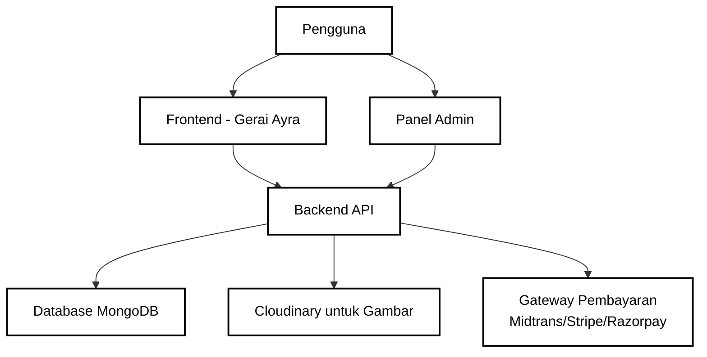
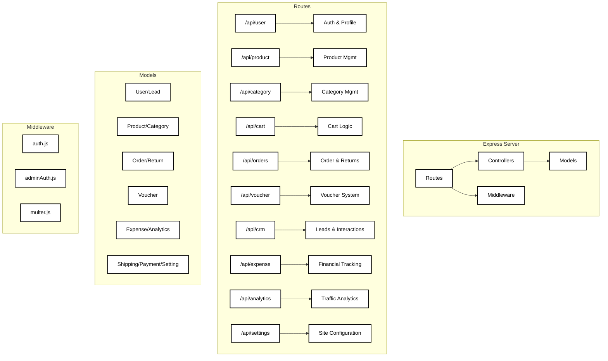
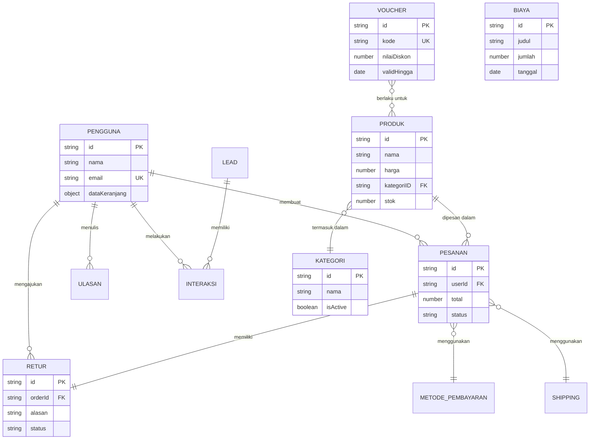
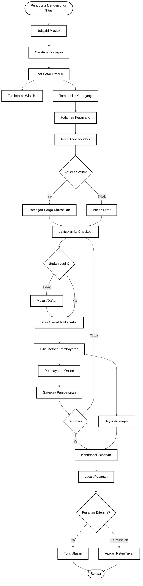
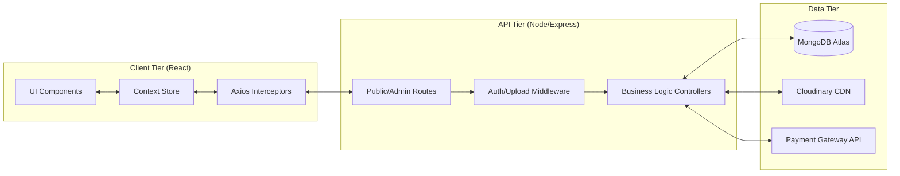
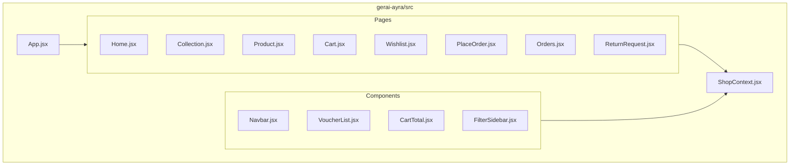
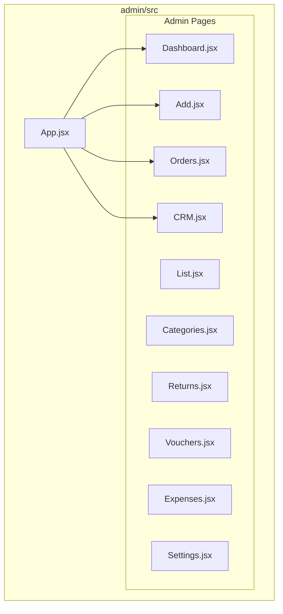

# Diagram Alir Aplikasi Gerai Ayra Fullstack (Updated)

## Arsitektur Tingkat Tinggi

## Struktur API Backend

## Relasi Skema Database (ERD)

## Alur Aplikasi - Perjalanan Pengguna

## Alur Panel Admin (Backoffice)

```mermaid
flowchart TD
    AdminStart([Login Admin]) --> Dashboard[Dashboard Analytics]
    
    Dashboard --> Inv[Manajemen Inventaris]
    Inv --> Category[Kelola Kategori]
    Inv --> Products[Kelola Produk & Stok]
    
    Dashboard --> Sales[Manajemen Penjualan]
    Sales --> Orders[Kelola Pesanan]
    Sales --> Returns[Kelola Retur & Refund]
    
    Dashboard --> Promo[Pemasaran]
    Promo --> Vouchers[Kelola Voucher]
    Promo --> Reviews[Moderasi Ulasan]
    
    Dashboard --> CRM[Hubungan Pelanggan]
    CRM --> Leads[Kelola Leads]
    CRM --> Interactions[Catat Interaksi WA/Email]
    
    Dashboard --> Finance[Keuangan]
    Finance --> Expenses[Input Pengeluaran Operasional]
    Finance --> Reports[Laporan Laba/Rugi]
    
    Dashboard --> Config[Konfigurasi Sistem]
    Config --> Shipping[Set Biaya Pengiriman]
    Config --> Payments[Set Metode Pembayaran]
    Config --> Settings[Update SEO/Logo/Kontak]

    classDef default fill:#ffffff,stroke:#000000,stroke-width:2px,color:#000000
    class AdminStart,Dashboard,Inv,Category,Products,Sales,Orders,Returns,Promo,Vouchers,Reviews,CRM,Leads,Interactions,Finance,Expenses,Reports,Config,Shipping,Payments,Settings default
```

## Data Flow Architecture

## Component Architecture (Frontend)

## Component Architecture (Admin Panel)

## Teknologi & Fitur Utama

- **Tech Stack**: MERN (MongoDB, Express, React, Node.js)
- **State Management**: React Context API
- **Styling**: Tailwind CSS
- **Voucher System**: Persentase/Potongan Tetap, Limit Penggunaan, Validitas Tanggal.
- **CRM System**: Tracking Lead & History Interaksi.
- **Finance**: Tracking Pengeluaran & Analitik Pendapatan.
- **Returns**: Sistem pengajuan retur barang dengan upload bukti gambar.
- **Settings**: Pengaturan website dinamis (Logo, Kontak, SEO).