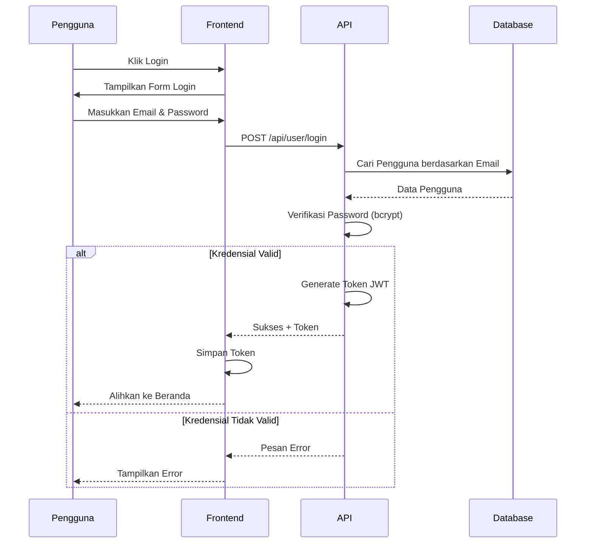
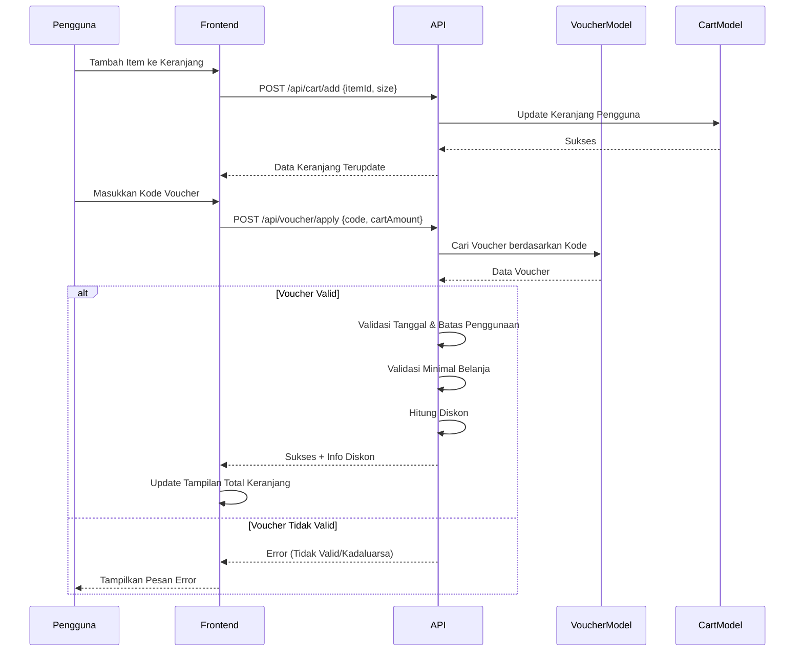
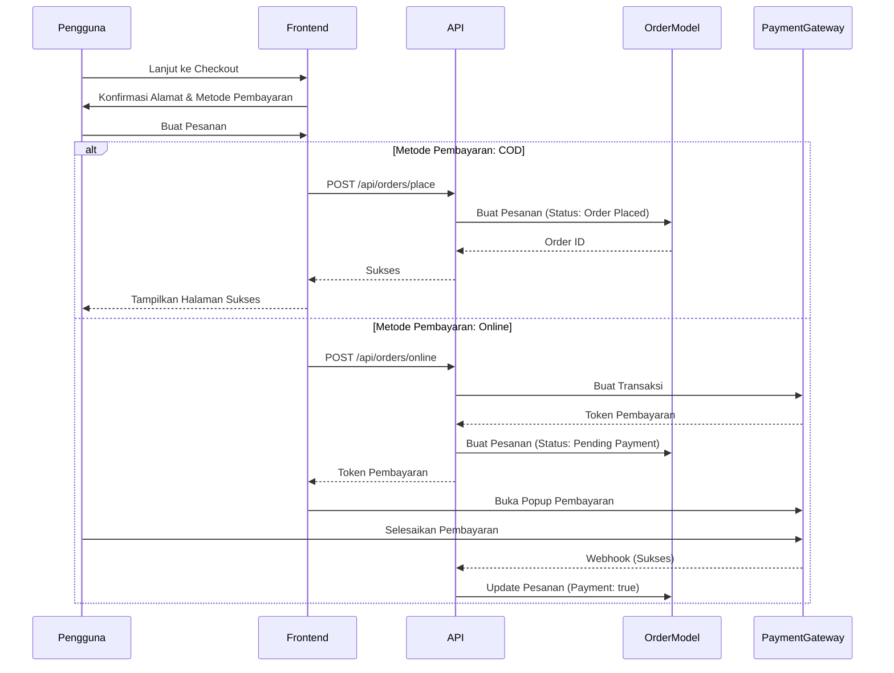
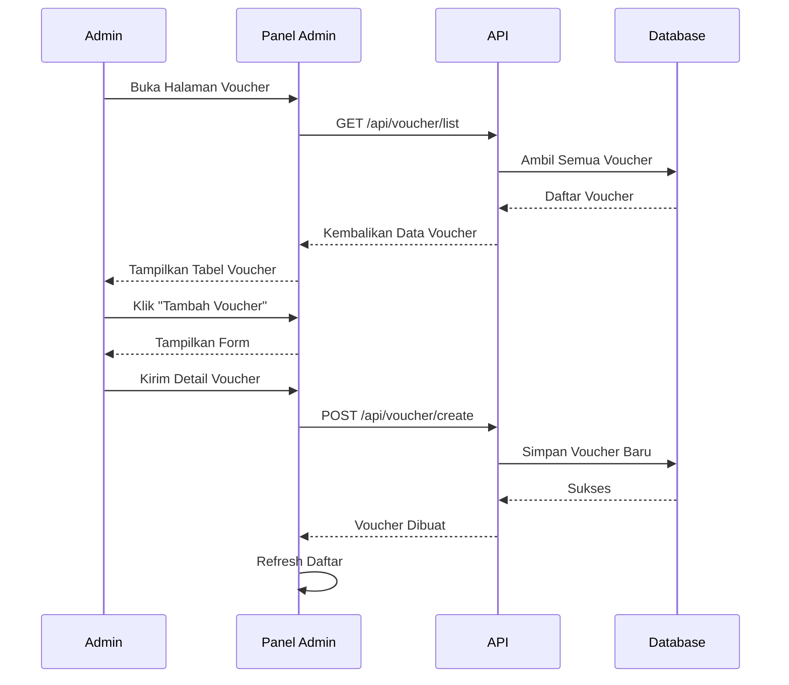
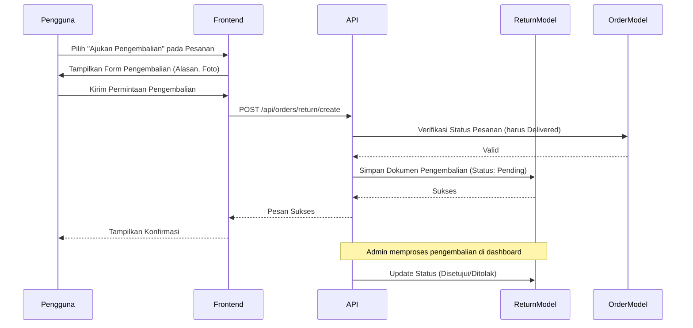
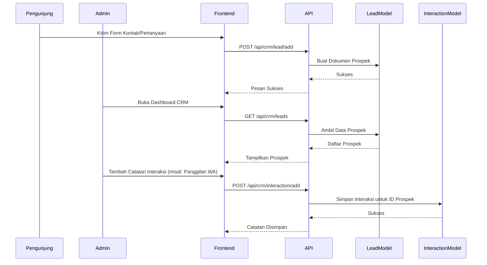

# Sequence Diagrams - Gerai Ayra

## 1. Alur Otentikasi

## 2. Alur Keranjang & Penerapan Voucher

## 3. Alur Pembuatan Pesanan

## 4. Manajemen Voucher Admin

## 5. Alur Pengembalian & Penukaran

## 6. Alur Prospek & Interaksi CRM

