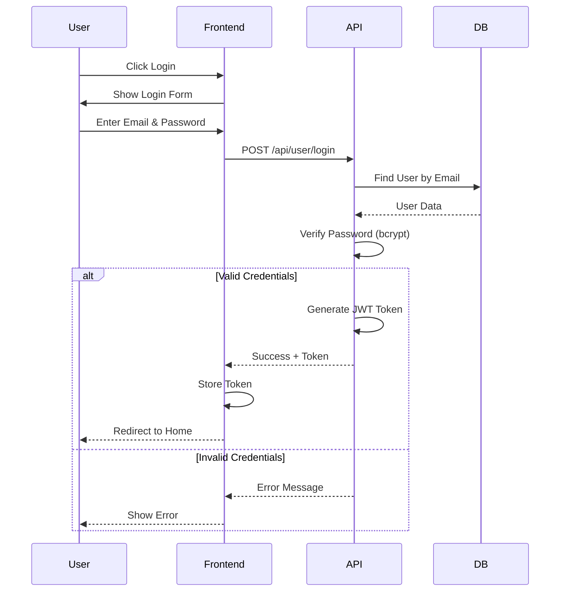
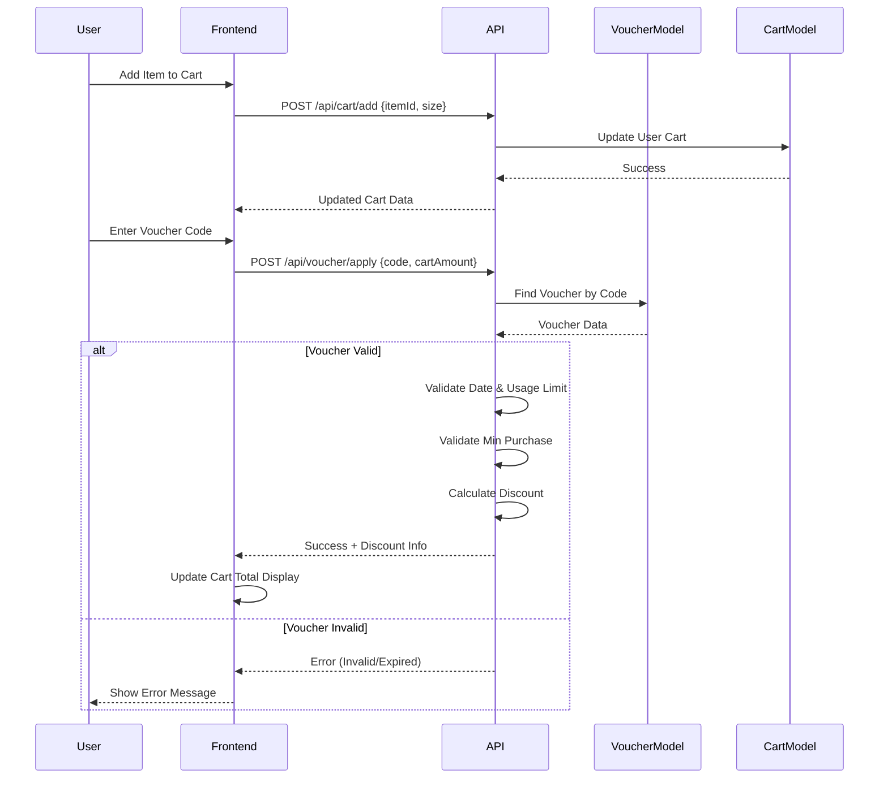
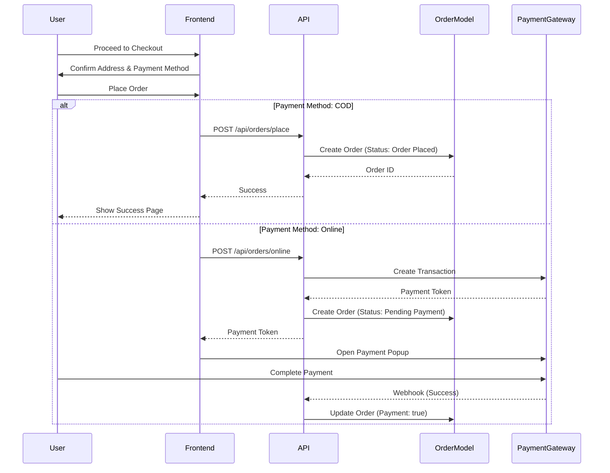
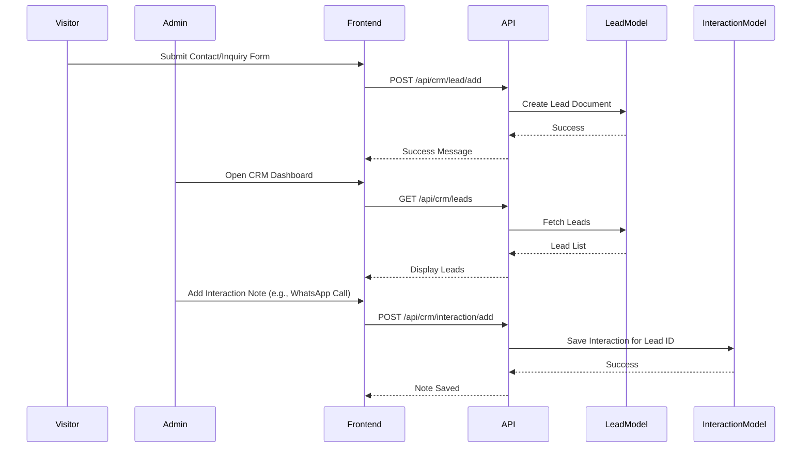

# Sequence Diagrams - Gerai Ayra

## 1. Authentication Flow


## 2. Cart & Voucher Application Flow


## 3. Order Placement Flow


## 4. Admin Voucher Management
```mermaid
sequenceDiagram
    participant Admin
    participant AdminPanel
    participant API
    participant DB

    Admin->>AdminPanel: Navigate to Voucher Page
    AdminPanel->>API: GET /api/voucher/list
    API->>DB: Fetch All Vouchers
    DB-->>API: Voucher List
    API-->>AdminPanel: Return Vouchers
    AdminPanel-->>Admin: Show Voucher Table

    Admin->>AdminPanel: Click "Add Voucher"
    AdminPanel-->>Admin: Show Form
    Admin->>AdminPanel: Submit Voucher Details
    AdminPanel->>API: POST /api/voucher/create
    API->>DB: Save New Voucher
    DB-->>API: Success
    API-->>AdminPanel: Voucher Created
    AdminPanel->>AdminPanel: Refresh List

## 5. Return & Exchange Flow
```mermaid
sequenceDiagram
    participant User
    participant Frontend
    participant API
    participant ReturnModel
    participant OrderModel

    User->>Frontend: Select "Request Return" on Order
    Frontend->>User: Show Return Form (Reason, Images)
    User->>Frontend: Submit Return Request
    Frontend->>API: POST /api/orders/return/create
    API->>OrderModel: Verify Order Status (must be Delivered)
    OrderModel-->>API: Valid
    API->>ReturnModel: Save Return Document (Status: Pending)
    ReturnModel-->>API: Success
    API-->>Frontend: Success Message
    Frontend-->>User: Show Confirmation

    Note over API,ReturnModel: Admin processes return in dashboard
    API->>ReturnModel: Update Status (Approved/Rejected)
```

## 6. CRM Lead & Interaction Flow

```
