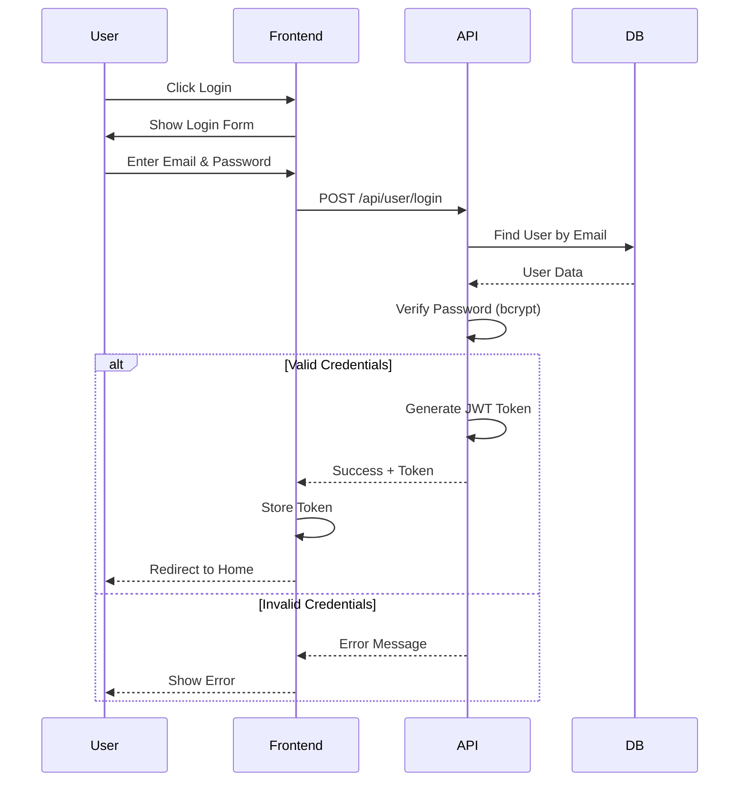
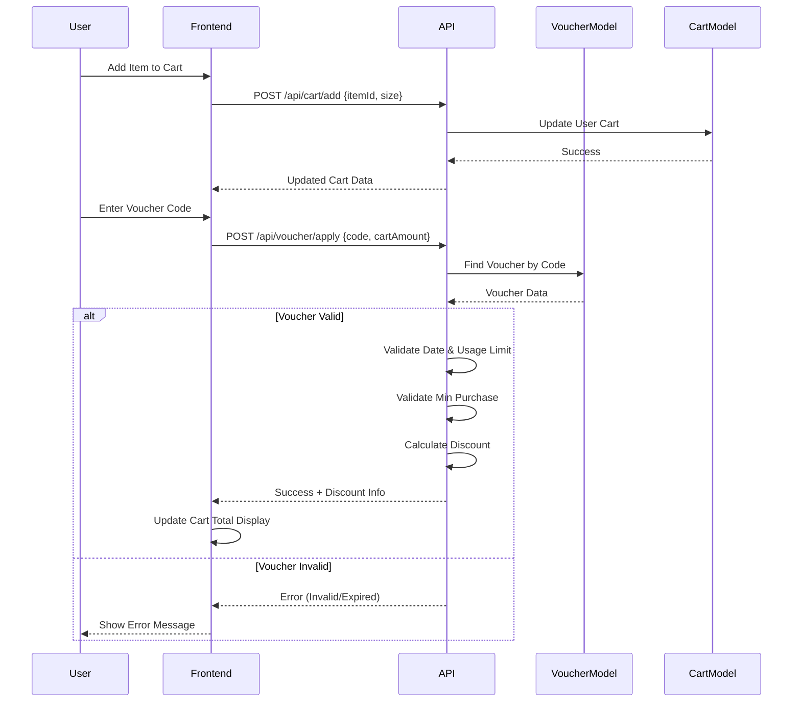
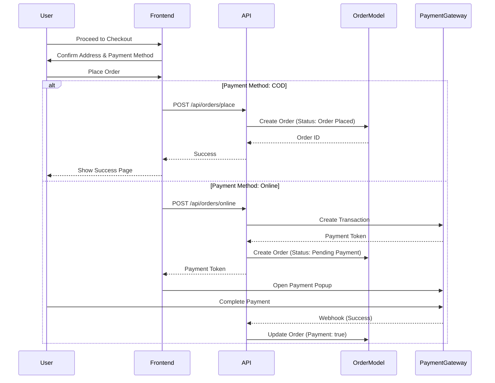
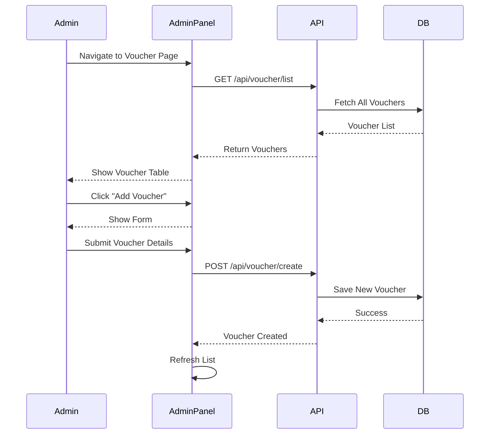

# Sequence Diagrams - Gerai Ayra

## 1. Authentication Flow

```mermaid
sequenceDiagram
    participant User
    participant Frontend
    participant API
    participant DB

    User->>Frontend: Click Login
    Frontend->>User: Show Login Form
    User->>Frontend: Enter Email & Password
    Frontend->>API: POST /api/user/login
    API->>DB: Find User by Email
    DB-->>API: User Data
    API->>API: Verify Password (bcrypt)
    alt Valid Credentials
        API->>API: Generate JWT Token
        API-->>Frontend: Success + Token
        Frontend->>Frontend: Store Token
        Frontend-->>User: Redirect to Home
    else Invalid Credentials
        API-->>Frontend: Error Message
        Frontend-->>User: Show Error
    end
```

## 2. Cart & Voucher Application Flow

```mermaid
sequenceDiagram
    participant User
    participant Frontend
    participant API
    participant VoucherModel
    participant CartModel

    User->>Frontend: Add Item to Cart
    Frontend->>API: POST /api/cart/add {itemId, size}
    API->>CartModel: Update User Cart
    CartModel-->>API: Success
    API-->>Frontend: Updated Cart Data

    User->>Frontend: Enter Voucher Code
    Frontend->>API: POST /api/voucher/apply {code, cartAmount}
    API->>VoucherModel: Find Voucher by Code
    VoucherModel-->>API: Voucher Data

    alt Voucher Valid
        API->>API: Validate Date & Usage Limit
        API->>API: Validate Min Purchase
        API->>API: Calculate Discount
        API-->>Frontend: Success + Discount Info
        Frontend->>Frontend: Update Cart Total Display
    else Voucher Invalid
        API-->>Frontend: Error (Invalid/Expired)
        Frontend-->>User: Show Error Message
    end
```

## 3. Order Placement Flow

```mermaid
sequenceDiagram
    participant User
    participant Frontend
    participant API
    participant OrderModel
    participant PaymentGateway

    User->>Frontend: Proceed to Checkout
    Frontend->>User: Confirm Address & Payment Method
    User->>Frontend: Place Order
    
    alt Payment Method: COD
        Frontend->>API: POST /api/orders/place
        API->>OrderModel: Create Order (Status: Order Placed)
        OrderModel-->>API: Order ID
        API-->>Frontend: Success
        Frontend-->>User: Show Success Page
    else Payment Method: Online
        Frontend->>API: POST /api/orders/online
        API->>PaymentGateway: Create Transaction
        PaymentGateway-->>API: Payment Token
        API->>OrderModel: Create Order (Status: Pending Payment)
        API-->>Frontend: Payment Token
        Frontend->>PaymentGateway: Open Payment Popup
        User->>PaymentGateway: Complete Payment
        PaymentGateway-->>API: Webhook (Success)
        API->>OrderModel: Update Order (Payment: true)
    end
```

## 4. Admin Voucher Management

```mermaid
sequenceDiagram
    participant Admin
    participant AdminPanel
    participant API
    participant DB

    Admin->>AdminPanel: Navigate to Voucher Page
    AdminPanel->>API: GET /api/voucher/list
    API->>DB: Fetch All Vouchers
    DB-->>API: Voucher List
    API-->>AdminPanel: Return Vouchers
    AdminPanel-->>Admin: Show Voucher Table

    Admin->>AdminPanel: Click "Add Voucher"
    AdminPanel-->>Admin: Show Form
    Admin->>AdminPanel: Submit Voucher Details
    AdminPanel->>API: POST /api/voucher/create
    API->>DB: Save New Voucher
    DB-->>API: Success
    API-->>AdminPanel: Voucher Created
    AdminPanel->>AdminPanel: Refresh List
```
