# Use Case Diagram - Sistem E-commerce Gerai Ayra

## Gambaran Umum Sistem

Sistem e-commerce Gerai Ayra merupakan platform online yang memungkinkan pelanggan membeli produk fashion, sementara admin dapat mengelola inventori dan pesanan.

## Aktor Utama Sistem

### **1. Pelanggan (Customer)**
- Pengguna akhir yang membeli produk
- Dapat melakukan registrasi, login, browsing, dan checkout

### **2. Admin Sistem**
- Pengelola platform
- Mengelola produk, pesanan, dan data pelanggan

### **3. Sistem Pembayaran (Payment Gateway)**
- Sistem eksternal Midtrans/Stripe/Razorpay
- Memproses pembayaran online

### **4. Sistem Pengiriman (Logistics)**
- Layanan pengiriman pihak ketiga
- Menangani pengiriman pesanan

### **5. Sistem Cloudinary**
- Storage gambar produk
- Mengelola upload dan optimasi gambar

---

## Use Case Diagram Utama

```mermaid
graph TD
    subgraph "Aktor"
        C[Pelanggan]
        A[Admin]
        PG[Payment Gateway]
        L[Logistics]
        CL[Cloudinary]
    end

    subgraph "Use Case Pelanggan"
        UC1[Registrasi Akun]
        UC2[Login Sistem]
        UC3[Browse Produk]
        UC4[Cari Produk]
        UC5[Lihat Detail Produk]
        UC6[Tambah ke Keranjang]
        UC7[Update Keranjang]
        UC8[Hapus dari Keranjang]
        UC9[Checkout Pesanan]
        UC10[Bayar COD]
        UC11[Bayar Online]
        UC12[Lacak Pesanan]
        UC13[Tulis Ulasan]
        UC14[Lihat Profil]
        UC15[Update Profil]
        UC16[Ganti Password]
    end

    subgraph "Use Case Admin"
        UA1[Login Admin]
        UA2[Verifikasi Admin]
        UA3[Kelola Produk]
        UA4[Tambah Produk]
        UA5[Edit Produk]
        UA6[Hapus Produk]
        UA7[Lihat Semua Pesanan]
        UA8[Update Status Pesanan]
        UA9[Kelola Ulasan]
        UA10[Approve/Ulasan]
        UA11[Dashboard Overview]
        UA12[Laporan Penjualan]
        UA13[Kelola Pengguna]
        UA14[Ubah Role Pengguna]
    end

    subgraph "Use Case Sistem Eksternal"
        UE1[Proses Pembayaran]
        UE2[Kirim Webhook]
        UE3[Kirim Notifikasi Pembayaran]
        UE4[Terima Pesanan]
        UE5[Pack Produk]
        UE6[Kirim Produk]
        UE7[Konfirmasi Pengiriman]
        UE8[Upload Gambar]
        UE9[Optimasi Gambar]
        UE10[Generate Thumbnail]
    end

    subgraph "Relasi Include"
        UC9 --> UC10
        UC9 --> UC11
        UA3 --> UA4
        UA3 --> UA5
        UA3 --> UA6
        UA9 --> UA10
        UA13 --> UA14
    end

    subgraph "Relasi Extend"
        UC3 -.-> UC4
        UC4 -.-> UC5
        UC6 -.-> UC7
        UC6 -.-> UC8
        UC12 -.-> UC13
        UA7 -.-> UA8
        UA11 -.-> UA12
    end

    subgraph "Asosiasi Aktor"
        C --> UC1
        C --> UC2
        C --> UC3
        C --> UC9
        C --> UC12
        C --> UC14

        A --> UA1
        A --> UA3
        A --> UA7
        A --> UA11

        PG --> UE1
        PG --> UE2
        PG --> UE3

        L --> UE4
        L --> UE5
        L --> UE6
        L --> UE7
    end

    C -.-> CL
    A -.-> CL
    CL --> UE8
    CL --> UE9
    CL --> UE10

    classDef aktor fill:#e1f5fe,stroke:#01579b
    classDef usecase fill:#c8e6c9,stroke:#1b5e20
    classDef include fill:#fff3e0,stroke:#f57c00
    classDef extend fill:#fce4ec,stroke:#c2185b

    class C,A,PG,L,CL aktor
    class UC1,UC2,UC3,UC4,UC5,UC6,UC7,UC8,UC9,UC10,UC11,UC12,UC13,UC14,UC15,UC16,UA1,UA2,UA3,UA4,UA5,UA6,UA7,UA8,UA9,UA10,UA11,UA12,UA13,UA14,UE1,UE2,UE3,UE4,UE5,UE6,UE7,UE8,UE9,UE10 usecase
```

---

## Detil Use Case Utama

### **Use Case: Registrasi Akun**
- **Aktor**: Pelanggan
- **Precondition**: Pengguna belum memiliki akun
- **Main Flow**:
  1. Pengguna mengisi form registrasi
  2. Validasi email dan password
  3. Sistem create JWT token
  4. Akun tersimpan di database
  5. Email konfirmasi dikirim
- **Postcondition**: Akun aktif dan pengguna logged in
- **Alternative Flow**: Email sudah terdaftar

### **Use Case: Browse dan Cari Produk**
- **Aktor**: Pelanggan
- **Precondition**: Sistem berjalan
- **Main Flow**:
  1. Pengguna akses halaman listing produk
  2. Sistem tampilkan produk dengan pagination
  3. Pengguna gunakan filter kategori/sub-kategori
  4. Pengguna cari dengan keyword
  5. Sistem tampilkan hasil pencarian
- **Postcondition**: Produk yang sesuai filter ditampilkan

### **Use Case: Proses Checkout**
- **Aktor**: Pelanggan
- **Precondition**: User logged in, memiliki item di keranjang
- **Main Flow**:
  1. Review item di keranjang
  2. Pilih alamat pengiriman
  3. Pilih metode pembayaran
  4. Sistem hitung total dan biaya pengiriman
  5. Jika COD: redirect ke konfirmasi
  6. Jika Online: redirect ke payment gateway
- **Postcondition**: Pesanan dibuat dengan status pending

### **Use Case: Bayar Online**
- **Aktor**: Pelanggan, Payment Gateway
- **Precondition**: Pesanan dibuat dengan metode online
- **Main Flow**:
  1. Sistem generate token pembayaran
  2. Redirect ke halaman gateway
  3. Pengguna input data pembayaran
  4. Gateway proses pembayaran
  5. Webhook dikirim ke sistem
  6. Sistem update status pembayaran
- **Alternative Flow**: Payment failed - redirect dengan error

---

## Use Case Admin Management

### **Use Case: Kelola Produk**
- **Aktor**: Admin
- **Precondition**: Admin logged in
- **Main Flow**:
  1. Admin akses halaman produk
  2. Sistem tampilkan list semua produk
  3. Admin pilih aksi: Tambah/Edit/Hapus
  4. Jika tambah: upload gambar ke Cloudinary
  5. Validasi dan simpan data produk
  6. Sistem refresh list produk
- **Postcondition**: Produk updated dalam database

### **Use Case: Update Status Pesanan**
- **Aktor**: Admin
- **Precondition**: Ada pesanan pending
- **Main Flow**:
  1. Admin view list semua pesanan
  2. Filter berdasarkan status
  3. Pilih pesanan untuk update
  4. Update status: Processing → Shipped → Delivered
  5. Jika perlu: cancel pesanan
  6. Sistem kirim notifikasi ke customer
- **Postcondition**: Status pesanan updated, customer diberitahu

### **Use Case: Generate Laporan**
- **Aktor**: Admin
- **Precondition**: Admin memiliki akses dashboard
- **Main Flow**:
  1. Admin pilih periode laporan
  2. Sistem query database penjualan
  3. Generate metrics: total sales, top products, customer stats
  4. Export ke format PDF/Excel
- **Postcondition**: Laporan tersedia untuk download

---

## Use Case Sistem Eksternal

### **Use Case: Proses Pembayaran Gateway**
- **Aktor**: Payment Gateway
- **Precondition**: Customer redirect ke gateway
- **Main Flow**:
  1. Gateway tampilkan form pembayaran
  2. Customer input data kartu/ewallet
  3. Gateway authorize transaksi
  4. Jika success: kirim webhook ke system hook
  5. System update payment status
  6. Kirim konfirmasi ke customer

### **Use Case: Upload Gambar Cloudinary**
- **Aktor**: Admin, System (via Cloudinary API)
- **Precondition**: Admin upload gambar produk
- **Main Flow**:
  1. System kirim file ke Cloudinary
  2. Cloudinary process dan optimize image
  3. Generate multiple size (thumbnail, normal, large)
  4. Return secure URLs
  5. System simpan URLs ke database produk

### **Use Case: Proses Pengiriman**
- **Aktor**: Logistic Partner
- **Precondition**: Pesanan status "shipped"
- **Main Flow**:
  1. Receive order data dari system
  2. Pack dan label products
  3. Assign tracking number
  4. Ship via logistic network
  5. Update tracking status real-time
  6. Confirm delivery dan kirim proof

---

## Matrik Use Case

| Kategori | Jumlah Use Case | Persentase |
|----------|----------------|------------|
| **Use Case Pelanggan** | 16 | 53% |
| **Use Case Admin** | 14 | 47% |
| **Use Case Sistem Eksternal** | 10 | 33% |
| **Total Use Case** | 26 | 100% |

### Prioritas Use Case Berdasarkan Frekuensi

1. **Login Sistem** - Digunakan setiap session
2. **Browse Produk** - Core functionality
3. **Tambah ke Keranjang** - Konversi sales
4. **Checkout Pesanan** - Revenue generation
5. **Lacak Pesanan** - Customer satisfaction
6. **Update Status Pesanan** - Admin daily task
7. **Kelola Produk** - Product maintenance

---

## Hubungan Antara Use Case

### **Include Relationships**
- "Checkout Pesanan" includes "Bayar COD" atau "Bayar Online"
- "Kelola Produk" includes "Tambah Produk", "Edit Produk", "Hapus Produk"
- "Kelola Ulasan" includes "Approve Ulasan"

### **Extend Relationships**
- "Browse Produk" dapat extends ke "Cari Produk"
- "Lihat Detail Produk" extends dari "Browse Produk"
- "Dashboard Overview" dapat extends ke "Generate Laporan"

---

## Non-Functional Requirements (NFR) per Use Case

### **Performance NFR**
- Response time < 2 detik untuk use case browsing
- Support 1000 concurrent users
- 99.9% uptime untuk payment processing

### **Security NFR**
- All login use cases require authentication
- Payment data encrypted end-to-end
- Admin operations logged untuk audit

### **Usability NFR**
- Mobile responsive untuk all customer use cases
- Intuitive navigation between product browsing to checkout
- Multi-language support (Indonesia/English)

---

## Testing Scenarios per Use Case

### **Happy Path Testing**
- Pelanggan registrasi → Browse → Cart → Checkout COD → Delivery → Review

### **Edge Case Testing**
- Empty cart checkout attempt
- Invalid payment data
- Out of stock product ordering
- Network failure during payment

### **Negative Testing**
- SQL injection attempts
- XSS vulnerabilities
- Unauthorized admin access
- Invalid JWT token usage

---

## Summary Use Case Analysis

### **Kekuatan Desain Saat Ini**
- Pemisahan yang jelas antara workflows customer dan admin
- Integrasi yang tepat dengan layanan third-party
- Coverage komprehensif dari browsing sampai delivery tracking
- Flows authentication dan authorization yang proper

### **Perbaikan Potensial**
- Tambahkan use case "Forgot Password" untuk customer
- Sertakan "Bulk Product Import" untuk efisiensi admin
- Tambahkan "Social Login" untuk registrasi yang lebih mudah
- Pertimbangkan use case "Live Chat Support" untuk customer service

### **Dampak Bisnis**
- **Perjalanan Customer**: Dioptimalkan dari discovery sampai delivery
- **Efisiensi Admin**: Management terpusat untuk semua operations
- **Skalabilitas Sistem**: Desain extensible untuk fitur masa depan
- **Integrasi Partner**: API integration yang robust dengan payment/logistics/cloud providers
