# Use Case Diagrams - "Classic" Style

> Diagram ini menggunakan format standar UML Use Case dengan batasan sistem (System Boundary), Aktor di luar sistem, dan Use Case (elips) di dalam sistem.

## 1. Customer Use Case Diagram

Menggambarkan interaksi Pelanggan dengan Sistem E-Commerce Gerai Ayra.

```mermaid
graph LR
    %% Actors
    C["👤 Pelanggan"]
    PG["💳 Payment Gateway"]

    %% System Boundary
    subgraph "Sistem Gerai Ayra (Frontend)"
        direction TB
        
        %% Account Use Cases
        UC1([Registrasi Akun])
        UC2([Login])
        UC14([Lihat Profil])
        UC15([Update Profil])
        
        %% Shop Use Cases
        UC3([Browse Produk])
        UC4([Cari Produk])
        UC5([Lihat Detail])
        UC6([Tambah ke Keranjang])
        UC18([Gunakan Voucher])
        
        %% Checkout Use Cases
        UC9([Checkout Pesanan])
        UC10([Bayar COD])
        UC11([Bayar Online])
        UC12([Lacak Pesanan])
        UC13([Tulis Ulasan])
    end

    %% Actor Relationships
    C --> UC1
    C --> UC2
    C --> UC3
    C --> UC9
    C --> UC12
    C --> UC14

    %% Internal Relationships (Include/Extend)
    UC3 -.->|<<extend>>| UC4
    UC4 -.->|<<extend>>| UC5
    UC6 -.->|<<include>>| UC2
    UC6 -.->|<<extend>>| UC18
    
    UC9 -->|<<include>>| UC10
    UC9 -->|<<include>>| UC11
    
    UC12 -.->|<<extend>>| UC13

    %% External System Relationship
    UC11 --> PG
    
    %% Styling
    style C fill:#f9f9f9,stroke:#333,stroke-width:2px
    style PG fill:#f9f9f9,stroke:#333,stroke-width:2px
    style UC1 fill:#fff,stroke:#333,stroke-width:1px
    style UC2 fill:#fff,stroke:#333,stroke-width:1px
    style UC3 fill:#fff,stroke:#333,stroke-width:1px
    style UC4 fill:#fff,stroke:#333,stroke-width:1px
    style UC5 fill:#fff,stroke:#333,stroke-width:1px
    style UC6 fill:#fff,stroke:#333,stroke-width:1px
    style UC18 fill:#fff,stroke:#333,stroke-width:1px
    style UC9 fill:#fff,stroke:#333,stroke-width:1px
    style UC10 fill:#fff,stroke:#333,stroke-width:1px
    style UC11 fill:#fff,stroke:#333,stroke-width:1px
    style UC12 fill:#fff,stroke:#333,stroke-width:1px
    style UC14 fill:#fff,stroke:#333,stroke-width:1px
    style UC15 fill:#fff,stroke:#333,stroke-width:1px
    style UC13 fill:#fff,stroke:#333,stroke-width:1px
```

## 2. Admin Use Case Diagram

Menggambarkan interaksi Admin dengan Panel Admin untuk manajemen sistem.

```mermaid
graph LR
    %% Actors
    A["👤 Admin"]
    CL["☁️ Cloudinary"]

    %% System Boundary
    subgraph "Panel Admin Gerai Ayra"
        direction TB
        
        %% Auth
        UA1([Login Admin])
        
        %% Product Mgmt
        UA3([Kelola Produk])
        UA4([Tambah Produk])
        UA5([Edit Produk])
        UA6([Hapus Produk])
        
        %% Voucher Mgmt
        UA15([Kelola Voucher])
        UA16([Tambah Voucher])
        UA17([Hapus Voucher])
        
        %% Order Mgmt
        UA7([Kelola Pesanan])
        UA8([Update Status])
        
        %% Other
        UA9([Moderasi Ulasan])
        UA11([Dashboard & Laporan])
    end

    %% Actor Links
    A --> UA1
    A --> UA3
    A --> UA15
    A --> UA7
    A --> UA9
    A --> UA11

    %% Includes/Extends
    UA3 -.->|<<include>>| UA4
    UA3 -.->|<<include>>| UA5
    UA3 -.->|<<include>>| UA6
    
    UA15 -.->|<<include>>| UA16
    UA15 -.->|<<include>>| UA17
    
    UA7 -.->|<<include>>| UA8

    %% External Links
    UA4 --> CL
    UA5 --> CL

    %% Styling
    style A fill:#f9f9f9,stroke:#333,stroke-width:2px
    style CL fill:#f9f9f9,stroke:#333,stroke-width:2px
    style UA1 fill:#fff,stroke:#333,stroke-width:1px
    style UA3 fill:#fff,stroke:#333,stroke-width:1px
    style UA4 fill:#fff,stroke:#333,stroke-width:1px
    style UA5 fill:#fff,stroke:#333,stroke-width:1px
    style UA6 fill:#fff,stroke:#333,stroke-width:1px
    style UA15 fill:#fff,stroke:#333,stroke-width:1px
    style UA16 fill:#fff,stroke:#333,stroke-width:1px
    style UA17 fill:#fff,stroke:#333,stroke-width:1px
    style UA7 fill:#fff,stroke:#333,stroke-width:1px
    style UA8 fill:#fff,stroke:#333,stroke-width:1px
    style UA9 fill:#fff,stroke:#333,stroke-width:1px
    style UA11 fill:#fff,stroke:#333,stroke-width:1px
```

### Keterangan Simbol
- **Kotak Besar**: Batasan Sistem (System Boundary), semua yang ada di dalam adalah fungsionalitas aplikasi.
- **Orang (Silhouette)**: Aktor (Pengguna atau Sistem Lain) yang berinteraksi dengan sistem.
- **Elips**: Use Case (Fitur/Fungsi).
- **Garis Panah Biasa**: Asosiasi langsung antara Aktor dan Use Case.
- **Garis Putus-Putus (<<include>>)**: Use case wajib yang merupakan bagian dari use case lain.
- **Garis Putus-Putus (<<extend>>)**: Use case opsional yang memperluas fungsionalitas use case lain.
