# Use Case Diagrams - Gerai Ayra Fullstack

> Diagram ini menggunakan format standar UML Use Case dengan batasan sistem (System Boundary), Aktor di luar sistem, dan Use Case (elips) di dalam sistem.

## 1. Customer Use Case Diagram

Menggambarkan interaksi Pelanggan dengan Sistem E-Commerce Gerai Ayra termasuk fitur baru seperti Wishlist dan Pengembalian.

```mermaid
graph LR
    %% Actors
    C["👤 Pelanggan"]
    PG["💳 Payment Gateway"]

    %% System Boundary
    subgraph "Sistem Gerai Ayra (Frontend)"
        direction TB
        
        %% Account Use Cases
        UC1([Registrasi Akun])
        UC2([Login])
        UC14([Lihat Profil])
        UC15([Update Profil])
        
        %% Shop Use Cases
        UC3([Browse Produk])
        UC4([Cari Produk])
        UC5([Lihat Detail])
        UC6([Tambah ke Keranjang])
        UC19([Tambah ke Wishlist])
        UC18([Gunakan Voucher])
        
        %% Checkout & Orders
        UC9([Checkout Pesanan])
        UC11([Bayar Online])
        UC12([Lacak Pesanan])
        UC13([Tulis Ulasan])
        UC20([Ajukan Retur/Tukar])
    end

    %% Actor Relationships
    C --> UC1
    C --> UC2
    C --> UC3
    C --> UC9
    C --> UC12
    C --> UC14
    C --> UC19
    C --> UC20

    %% Internal Relationships (Include/Extend)
    UC3 -.->|<<extend>>| UC4
    UC4 -.->|<<extend>>| UC5
    UC6 -.->|<<include>>| UC2
    UC6 -.->|<<extend>>| UC18
    
    UC9 -->|<<include>>| UC11
    UC12 -.->|<<extend>>| UC13
    UC12 -.->|<<extend>>| UC20

    %% External System Relationship
    UC11 --> PG
    
    %% Styling
    style C fill:#f9f9f9,stroke:#333,stroke-width:2px
    style PG fill:#f9f9f9,stroke:#333,stroke-width:2px
    style UC1 fill:#fff,stroke:#333,stroke-width:1px
    style UC2 fill:#fff,stroke:#333,stroke-width:1px
    style UC3 fill:#fff,stroke:#333,stroke-width:1px
    style UC19 fill:#fff,stroke:#333,stroke-width:1px
    style UC20 fill:#fff,stroke:#333,stroke-width:1px
```

## 2. Admin Use Case Diagram

Menggambarkan interaksi Admin dengan Panel Admin untuk manajemen sistem yang lebih luas (CRM, Analytics, Finance, dsb).

```mermaid
graph LR
    %% Actors
    A["👤 Admin"]
    CL["☁️ Cloudinary"]

    %% System Boundary
    subgraph "Panel Admin Gerai Ayra"
        direction TB
        
        %% Auth
        UA1([Login Admin])
        
        %% Core Mgmt
        UA3([Kelola Produk & Kategori])
        UA7([Kelola Pesanan & Retur])
        UA15([Kelola Voucher])
        
        %% CRM & Marketing
        UA21([Kelola Leads & Interaction])
        UA9([Moderasi Ulasan])
        
        %% Finance & Analytics
        UA22([Input Pengeluaran/Expense])
        UA11([Dashboard & Analytics])
        
        %% Configuration
        UA23([Konfigurasi Payment & Shipping])
        UA24([Update Pengaturan Situs])
    end

    %% Actor Links
    A --> UA1
    A --> UA3
    A --> UA7
    A --> UA15
    A --> UA21
    A --> UA22
    A --> UA11
    A --> UA23
    A --> UA24

    %% Internal Details (Hidden for clarity in main view, but part of logic)
    UA3 -.->|<<include>>| CL
    UA7 -.->|<<include>>| UA8([Update Status])

    %% Styling
    style A fill:#f9f9f9,stroke:#333,stroke-width:2px
    style CL fill:#f9f9f9,stroke:#333,stroke-width:2px
    style UA1 fill:#fff,stroke:#333,stroke-width:1px
    style UA3 fill:#fff,stroke:#333,stroke-width:1px
    style UA21 fill:#fff,stroke:#333,stroke-width:1px
    style UA22 fill:#fff,stroke:#333,stroke-width:1px
    style UA11 fill:#fff,stroke:#333,stroke-width:1px
    style UA23 fill:#fff,stroke:#333,stroke-width:1px
    style UA24 fill:#fff,stroke:#333,stroke-width:1px
```

### Penambahan Fitur Terbaru
Berdasarkan pembaruan codebase, diagram di atas kini mencakup:
1.  **Sistem Retur (Return/Exchange)**: Pelanggan dapat mengajukan pengembalian, dan Admin dapat mengelola statusnya.
2.  **CRM (Customer Relationship Management)**: Fitur pengelolaan Lead (calon pelanggan) dan Interaction (catatan komunikasi via WhatsApp/Email).
3.  **Analytics & Page Views**: Pemantauan statistik pengunjung harian.
4.  **Expense Tracking**: Pencatatan biaya operasional atau pembelian stok oleh Admin.
5.  **Category Management**: Pemisahan logika kategori produk yang lebih terstruktur.
6.  **Shipping & Payment Configuration**: Pengaturan metode pengiriman dan pembayaran langsung dari panel admin.
7.  **Wishlist**: Kemampuan pelanggan untuk menyimpan produk favorit.
8.  **Site Settings**: Pengaturan SEO, Logo, Favicon, dan informasi kontak secara dinamis.

### Keterangan Simbol
- **Kotak Besar**: Batasan Sistem (System Boundary).
- **Aktor**: Entitas luar (Manusia atau Layanan Cloud).
- **Elips**: Use Case (Fungsi spesifik).
- **Lines**: Relasi interaksi.